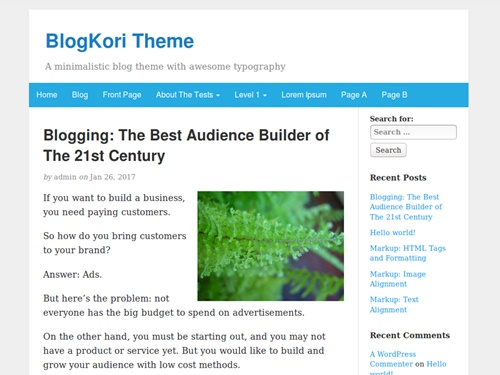

Steve Jobs and his first iPhone changed everything. We were introduced to a new era. After the launch, every other phones were just a copy of the iphone. But I am not here to talk about the technological revolution of the smartphone industry.

I want to discuss the lessons I learned from Apple’s iPhone from a product development perspective.

<!-- truncate -->

## Start Simple

If you look at the original iPhone, you would realize how lame that phone was. It didn’t had video recording option, no 3G, and many modern features you would expect from a new phone.

Apple could have put so many things into the iPhone and make it a killer feature rich smartphone, but they went for the simple route.

More feature means more research and development time. Steve Jobs and his team brought the minimum viable product to the market and see the reaction.

Although it lacked many essential features of a modern phone that time, it did just a few things right.

For the iPhone, its wow factor was the full screen touch screen, rotating screen, iPod, internet and messaging features.

## Sell on The Benefits

Steve Jobs talked about the user interface and how it is built for day to day situations. He got rid of the stylus in favor of finger touch. He scrolled down the contact list, the music library to show how easy it is to scroll through the long list of items with a touchscreen.

Messages were modern and looks like modern messaging apps. You need to swipe to unlock the screen so that it does not accidentally unlocks in your pocket.

He didn’t sold on how much ram or processing power the phone has, all he did was show what the iPhone can do.

## Add Another Feature in Your Next Version

The next iPhone had some extra features like video recording, 3G and faster speed. They could have included it on the first iphone but they didn’t. They made it into a second version just so they can sell more units.

I don’t like that companies making products that don’t last longer. To increase the profits they launch a new product every year with slightly more features than before and drop support for the older ones.

Since the first iPhone, Apple kept launching one/two new iPhones every year with slightly better features. So please take note, if you want to increase your profit margins, launch new versions of the same product to sell more and more copies.

## Applying Steve Jobs’ Formula on My Own:

Few years ago I learnt about WordPress theme development and I was so hooked up to create my own themes. For my first theme to the public, I thought of going the easy way by creating a free theme. This way, the expectations would be low.

Then I applied Steve Jobs’ iPhone formulla, by stripping out all the modern features of that theme and just go with a simple presentable theme.

I was still learning at the moment and implementing many features would increase the development time.

So I created version 1.0 of that theme with some basic features.

The theme was so simple with nothing more than just regular WordPress features, like custom header, background image, background color etc. These are default features which come with WordPress.

**My finished version was pretty plain.**

The first theme had this default blue color scheme which you can’t even change from the options.

I ignored what my theme doesn’t have and used what I have:

I talked about the benefits of using the theme like

- Having a good typography keeps the reader engaged
- Simple site loads faster
- The code has HTML5 semantic markup for better search rankings etc.

So anyways I put the theme out to the public. A few people tried it out and started to use it.

I added a few more code improvements and submit the theme to WordPress theme directory. After it was approved, I saw lots of downloads.

People loved my free theme. More than 1,000 people are using the theme. Every now and then I get message from people who are using and loving the theme.

It motivated me and got me to work on the theme again.

On the next version I added Google Analytics options, then followed by color scheme option.

You see, I did not wasted my time trying to make my product filled with lots of cool features. I stick to the essentials, get it out to the public and talked about the benefits.

## Conclusion:

We can learn a lot by following Steve Jobs and Apple products. Just watching one video how Steve launches a new product can teach you a lot about selling technology to the masses.

https://www.youtube.com/watch?v=wGoM_wVrwng

To sum it all up:

1. Create a minimum viable product (MVP) and get it out to the public for feedback
2. Add more features as you go on with next iterations
3. Talk about the benefits, not the features

## Comments:

**Ryan Biddulph:** Good analogy Tamal! Simple wins. Every time. Simple, clear, basic, all are winning elements in the product development game. This is why all of my eBooks, courses and audio books are simple. The ultimate lesson in life is to keep things basic, to remove the complex, and folks doing this become icons. You are on your way brother.

Ryan

> Tamal: Good to see you here buddy! Yes, simple rocks!
