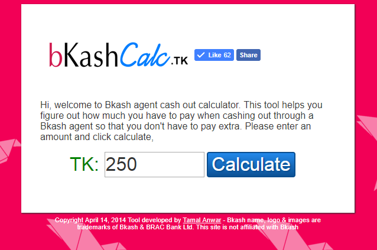
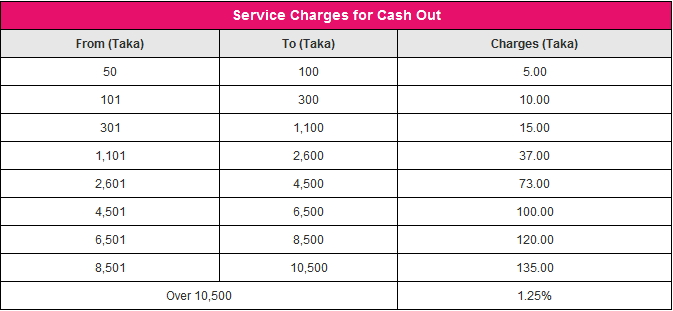
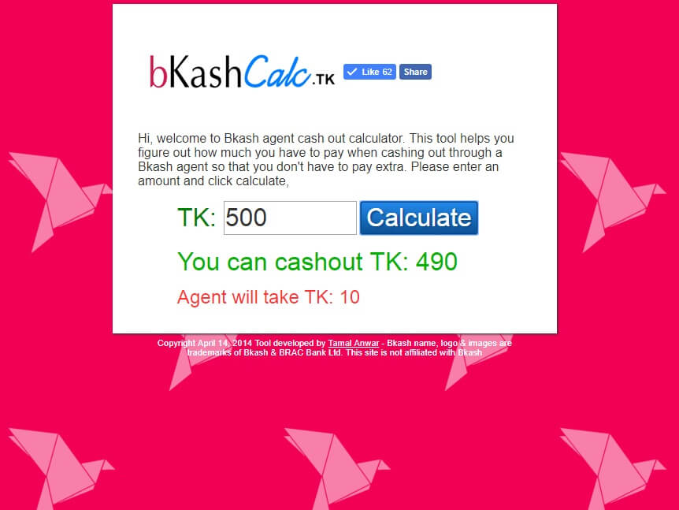
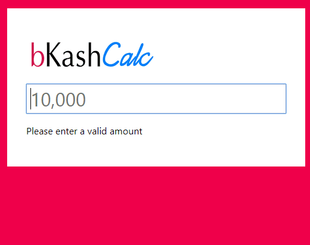

It’s time I look back at one of my very first JavaScript work and roast it.

It was 2014, I had recently finished JavaScript and JQuery lessons from Codecademy. It was about time I build something with my knowledge.

At that time I didn’t know what actually JQuery was. I thought it’s another language like JS. Now I know well that, JQuery is a library which goes on top of JavaScript. It makes writing code a little bit easier.

An overview of what I am going to build:



<!-- truncate -->

There is a mobile payment service in Bangladesh called Bkash. You can use the service to pay friends. They charge a % for every time you want to cash out from your wallet.

The idea was simple,

1. Have a text field so people can input an amount
2. Click on the button to calculate the result
3. The fee amount will show up

I could not sleep the previous night. So I got up to my computer with enthusiasm. I built the logic first.

While trying to work on it, I learned the hard way: following a tutorial is easy but building something on my own doesn’t always behave the same way.

## The JavaScript

Looking at my code, I rush coded a lot. I did not comment on the code, I didn’t even use semantic variable names.

```js
var $b = $('input[name=bkashamount]').val()
var $c = $cashout()
```

Variable `$b` should have been called `balance`.

`$c` should have been `change`.

I also didn’t add a class or ID for the input button text, which would’ve to make my life a bit more easier.

So you see all the code is a mess and harder to follow through.

The conditional logic tree was the hardest part.

It took me more than an hour to create a simple calculation to work. At the time of building the calculator, Bkash had a different fee structure.

Their fee % varies on the amount you are cashing out.



So I had to write a long set of conditions to fit the fee structure.

It was a really long (6-8) steps of else if codes.

It was a nightmare to make this work. So after I was done, I could display both a smaller amount and a larger amount with the correct fee.

## New Fee Structure

Right after I implemented the cumbersome fee, I did a lookup online and found that Bkash now has a simplified fee structure.

What you know, they now have 1.85% flat fee for any amount you wanna cash out.


If I had known this earlier, it would have saved me a lot of trouble.

Anyways, I implemented the new fee structure.

After a few tweaks and checking my code part was ready.

## HTML Page

The site has just a single HTML page for the view. It was the first time I coded a page without the help of the Bootstrap framework. At the time I did not know how to create a container in the middle so I used a table markup.

```html
<table>
		<thead>
		</thead>
		<tbody>
			<td>
				<td><h1><a href="/"></a></h1></td>
				<td><iframe src="//www.facebook.com/plugins/like.php?href=https://tamalanwar.github.io/bkash-calc/%2F&amp;width&amp;layout=button_count&amp;action=like&amp;show_faces=false&amp;share=true&amp;height=21&amp;appId=114661981960459" scrolling="no" frameborder="0" style="border:none; overflow:hidden; height:21px;" allowTransparency="true"></iframe></td>
			</tr>
		</tbody>
	</table>
```

A table really?

Look, I also invented a new HTML tag called the `<wrapper>` wow!

Other than these rookie mistakes, the final design was good. It also had Facebook open graph tags which looked nice when I shared on social media.


I also registered a free domain name BkashCalc.tk to host it.

I was happy and proud to share my work. Overall it was a good first project.

You can have a look at the working version here and the source code on Github.

Since then I made a new Bkash calculator with React:



I don’t have the live version up but you can have a look at the source code.
