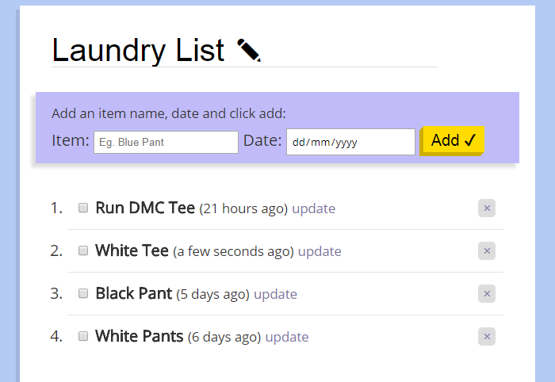
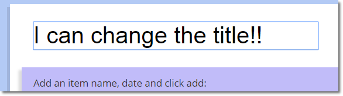
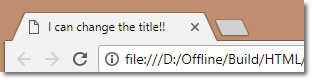

Last week I ran into a real world problem.

It’s hard to keep track of my washed and dirty clothes. I have no idea how long it’s been since last wash. So I needed to track them by making a list and counting the dates.



The first idea is obviously writing them down on paper, but then I thought why not use my JavaScript skills to build an app to track it?

<!-- truncate -->

## The initial idea:

It’s a one page app with a To-Do list kind of functionality. I want to be able to add and remove items. In this context, my items are the clothes.

I also want to add a date into that clothe and count how many days have been passed.

Doing a quick google search revealed that there is a Date object in JavaScript which I can tap into.

So for every clothe, I attached the current date into it.

I created an array of objects. Each object being the item of clothing that has an item text and a date field.

```js
const sampleData = [
  { text: 'Sample Item', date: '2018-05-21T14:53:18.883Z', done: false },
  { text: 'Another Sample', date: '2018-05-21T14:53:26.899Z', done: false },
]
```

For now I just need these two things.

## Tracking how many days passed

In my mind I thought I had to do some calculations and save the new data in a new field for how many days passed. Then I remembered, there is a cool library called Moment.js.

If I put the date into the moment function, it will show a nice little relative time like **2 days ago** or **7 days from now.**

So I quickly implemented momentjs into my application. This saved me a lot of work trying to calculate the relative days.

## Saving the data

So for an application like this, the data has to be stored somewhere. I can’t just open the app, add items and when I refresh the page it’s all gone.

I know how to add data into database, but for that I will need to make it into a Node.js app with MongoDB and specialized web hosting. It’s just a side project, I don’t want to go in all the trouble for this.

I searched online and found there is an api called localStorage.

So with localStorage you can save some text data into a user’s browser.

This is just the thing I need for my app. So I went ahead and look into ways to implement it.

So when I add items into my list, it will be stored in my web browser as local storage.

## Making it work

I coded the basic implementation of the app, but I was running into problems. The main problem I faced was, I created a variable called “items” and this variable contained the array of objects. The object was grabbed from the local storage.

```js
const items = JSON.parse(localStorage.getItem('items'))
```

But when you open the app for the first time, there is no local storage and no data in that variable, this led to huge problems.

I found Wes Bos had a [dedicated video tutorial](https://www.youtube.com/watch?v=YL1F4dCUlLc) on localStorage api. I looked into the tutorial and it helped a lot to build out my app. His walkthrough helped build this app in a much more efficient way.

So to solve my initial problem, I set my items variable to the data found from localStorage. But when there is no local storage, it will fall back to an empty array [ ].

```js
const items = JSON.parse(localStorage.getItem('items')) || []
```

## Designing the frontend & putting it all together

After my app was working as I wanted, I went on to my favorite part: the design. I worked a few hours to come up with a sleek user interface.

I built the items into an ordered list, so they come with numbers.

I did some CSS work to make the app look pretty.

## Making it general purpose

I built this glorified ToDo list to track my laundry, but not everyone will be using it for the same purpose. So I went ahead and made it more “general”

I made the title into something which the user can change.



I made the title into a form field and when the user clicks on it, he/she can change it to something else.

I also made the website title tag into the title of the app and also saved it into local storage.



I did it by setting the document.title property to my variable:

```js
// 1. Getting the title from local storage OR fallback to default title
let title = localStorage.getItem('localTitle') || 'Laundry List ✎ Edit this!'
// 2. Getting the title from the form
document.querySelector('[name=title]').value = title
// 3. Setting the document title tag
document.title = title
```

## Final thoughts

I had fun working on this little thing. It’s really useful too! I am using it to properly track my laundry.

I am also going to work on a portable mobile version, so people can use it offline and in mobile too.

This little side project taught me so many new things. You can check out the [finished version over here](https://tamalweb.github.io/ClothesWashTracker/).
