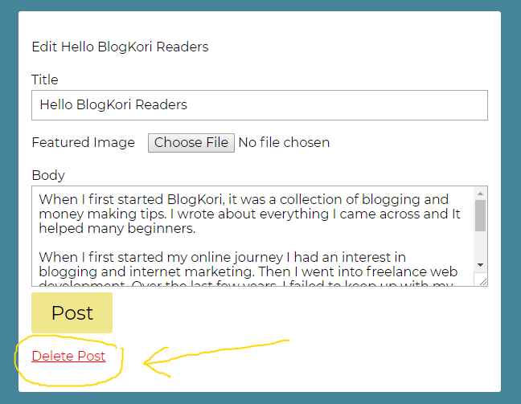
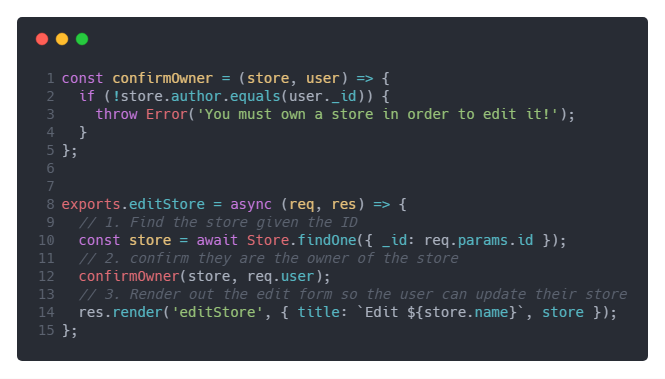
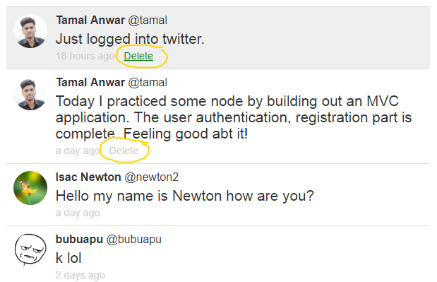

The first thing you learn when building a web application is **CRUD**, Create Read, Update and Destroy. I was learning Node.js to build the backend of my application. The first few lessons were about creating data, and then editing it.

In MongoDB mongoose, there are some handy commands for creating, editing items. Let’s say I have a blog post which I created. To edit it, I call the `.findOneAndUpdate()` method for editing the existing collection.

I soon figured out there must be a `.removeOne()` or `.deleteOne()` method to delete an item from the database collection.

I gave that a try.



<!-- truncate -->

I created a controller to delete a collection, with some trial and error I was able to figure out the command for deleting a blog post is running the `.deleteOne()` method on my Blog object.

In my router, I used a GET method for this delete option. Anytime I call the delete route, the post with that ID will be deleted.

This week I am building a twitter clone with Node.js. Here I have a bunch of tweets posted by bunch of users.

Now here’s the problem, anyone can delete a tweet with the delete button, even the people who are not even logged in.

You can type in the `Site.com/delete/5b16d5ac27542f10343e2717` and can manually delete any tweet from the database, because it’s a `GET` request.

To fix this issue, I added a controller to check if the user is logged in to complete this action.

```js
router.get(
  '/delete/:id',
  authController.isLoggedIn,
  tweetController.deleteTweet
)
```

Okay, now only the logged in users can delete a tweet. But the problem was still there, anyone can delete any tweet.

So I have to use a permission for deleting. Only allow the owner of that tweet to be able to delete it.

I modeled this code after Wes Bos’ LearnNode course. In video #29 he shows how to display the edit screen only to the owner of that store.

The code looks like this:



So first I load up the store from the database and check for if the user actually owns the store. If the user owns the store, only then I will render the edit store page.

However this won’t work with the delete action. You see if I call .deleteOne(), then the tweet will be already deleted.

So instead I called the tweet first and then checked if the user owned that tweet.

```js
exports.deleteTweet = async (req, res) => {
  try {
    const tweet = await Tweet.findOne({ _id: req.params.id })
    if (!req.user.username === 'tamal') {
      confirmedOwner(tweet, req.user)
    }

    const deleteTweet = await Tweet.deleteOne(tweet)
    res.redirect('back')
  } catch (e) {
    console.log(e)
    res.redirect('/?msg=Failed to delete')
  }
}
```

Once he/she is a verified owner, only then run the next command which is deleting the tweet.

This made things bulletproof for now. Only the logged in users, who actually owned the tweet can delete it.

The final step was to only show the “Delete” link to the owner of that tweet.


