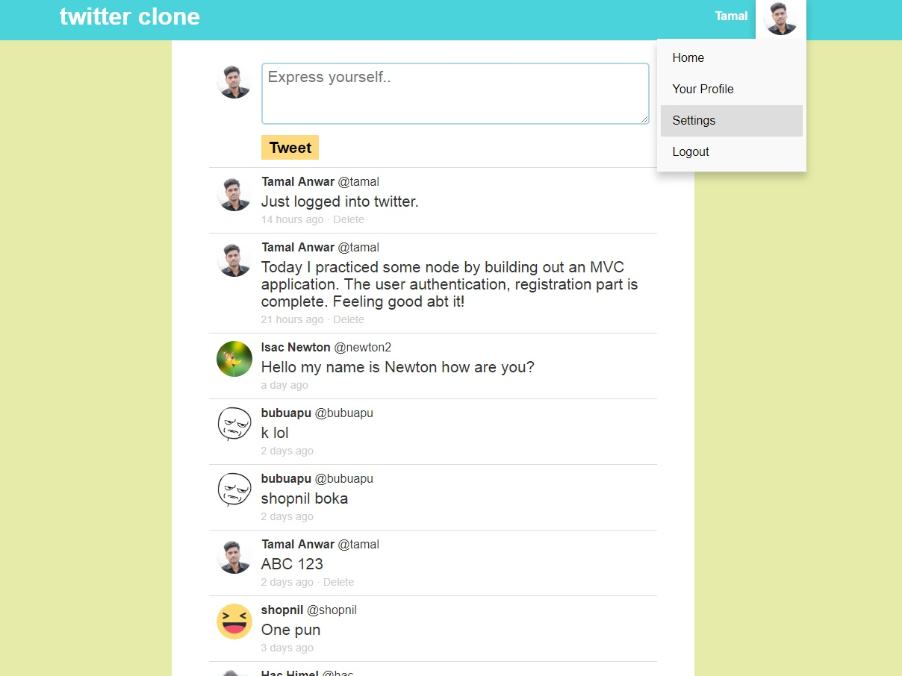

Last season I built a twitter clone in Node.js. It’s a social media web application built with Node.js, Express, Mongoose and Passport.js.

I deployed the app into a live server in Heroku, making it my first live Node/Express app.

I first shared the link onto the Node.js Facebook group for feedback. I also asked people not to attack it.

Here’s the app in action: https://www.youtube.com/watch?v=fMIU9cG4qmw

So after launching the site, so many things I realized for the first time. Let me start with the positive first:

<!-- truncate -->

## The Positive

The twitter clone app gave me confidence as a newbie web developer. This is the first time I built a full stack web application without WordPress. I got lots of positive feedback for this project.

I was taking the Node course from Wes Bos. The final chapter showed how to deploy the app on the internet. After learning it, I quickly built out this twitter clone app and put it out.

I am especially fond of the design of the app. I did this design with vanilla CSS with the pug template engine.

## The Negative

For starters, the app I built is super slow. This probably because I am using free web hosting from Heroku and a free tier database from mlab.

Also for every request, I make (creating a tweet) the app reloads the page. All this makes the user experience laggy. I would call it the very early version of the original twitter site, and not a complete twitter clone.

After a while, all the profile pictures disappear. This is probably because Heroku does not allow image hosting. My app also has some security flaws which I have to learn and implement into the next projects.

My site is not mobile responsive either. I just wanted to put it up online as quickly as possible. From next time on, I will go with mobile-first approach.

## After Twitter Clone

After finishing the Node course (and the twitter clone) I took some break from Node.js. I went on and took another course for React.js. I spent some time learning React, as my end goal is to build web apps with the MERN stack (Mongo, Express, React & Node)

I spent a few weeks with React, building a few small apps. Then lately I reunited again with Node.js. This time I am building apps with Node and React combined.

The idea is to build the backend API with Node/Express and the front-facing user interface with React.

So this means if I refactor the twitter clone in React, then I will be able to make it respond faster (like realtime).

I also need to learn more about test-driven development so I can make better apps.

## Verdict

So looks like I am not happy with my creation, that’s one reason it took me so much time to write about it. It’s actually a positive thing, this means my expectations are much higher. I just have to work on honing my skills and keep on building. Here’s the Github repo.
