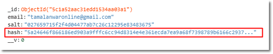

What do you do with your user’s password? Do you store it into the database?

You don’t!

You should never store the raw password into your application.

Some badly coded websites store the raw password into their database.

They store the actual password and even send you via email:


This means your password is at risk.

(by the way, I didn’t code that website, I used a plugin called DAP in WordPress)

<!-- truncate -->

As an app developer, you should not store the actual password into your database.

And, as a user you should stay away from such sites and inform the webmaster.

## Hash the password and store it into your database

So instead of storing the actual password, you cryptographically hash the password and then store the hash instead of the password.



If I don’t store the password, then how people are supposed to log back in?

When someone tries to log in, they will enter their password. You will have to run the hashing function again with that given password. Then you match this new hash with the stored hash.

When you hash the same password with the same secret key, you will get the same hash string.

So it will be a match and you know the password was correct and you go ahead and login the user.

This is why when you forget the password, you don’t get to see the password, instead they send you a link to reset the password. Behind the scenes you are just creating a new hash in the system.

## Hash the password with a salt

Now normally I would hash the password with a secret key. The problem is, two users may have the same password. Let’s say two users have used 1234 as their password. When your system hashes the password, both user will have the same hash. If your database gets stolen and the hacker sees, those 2 users have the same hash, that means their passwords are the same. This makes things easier for the hacker.

To fix this, you have to generate a new string which will act as a salt. This salt will also be saved into the database for each user. Each of these salts will be unique per user.

So next, instead of hashing the password with a secret key, you use the salt to hash the password. That way now you will get a unique hash per user.

## Code examples:

Here’s how I created a salt using the crypto module in Node.js:

```js
var crypto = require('crypto')
var createTheSalt = function () {
  return crypto.randomBytes(20).toString('hex')
}
```

And here I’m using the salt and the given password to hash the password:

```js
var crypto = require('crypto');
var hashThePassword = function(password, salt) {
  password =
    password.length && typeof password === 'string' ? password : undefined;
  if (password && salt) {
    // Create the salt
    let hash = crypto
      .createHmac('sha512', salt)
      .update(password)
      .digest('hex');
    // Return a salt and hash object
    return { salt, hash };
  } else {
    return null;
  }
```

So the next time you come across a website which sends your actual password when you forgot the password, know that your data is in wrong hands.
