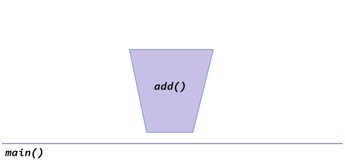
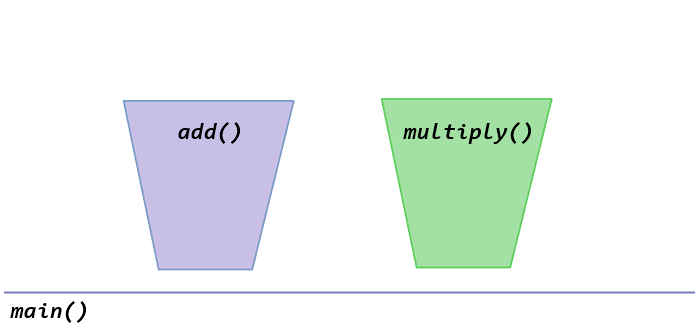
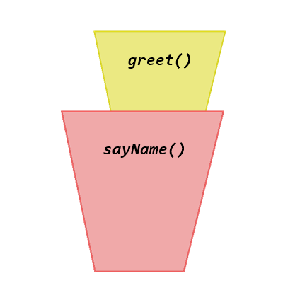
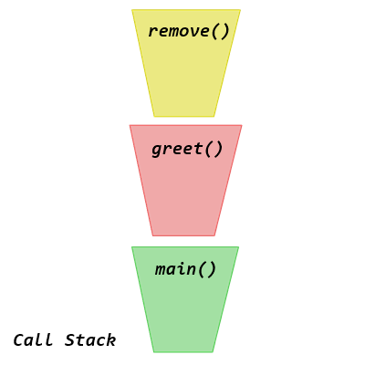
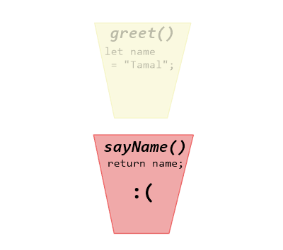
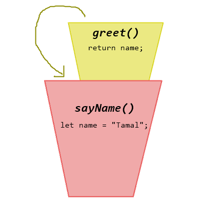

A closure happens when one function is inside another function, and the inner function wants to access a variable which belongs to the outer function.

In JavaScript every function creates its own scope. We may not realize it just by looking at the code, it will help if we visualize it like this:

<!-- truncate -->

The floor is like the main function scope or the global scope.

Every time you create a new function, it will be like a bucket.

All the variables you create inside that bucket (function) will only be accessible within that bucket only.

You can create a function inside another function, or to say bucket inside another bucket.

JavaScript likes to execute each of these functions in stack order. It will stack them all on top of each other and the topmost item will be executed first. After that JS will delete the bucket and move on.

For this reason an outer function won’t have access to a variable which was inside another function. Because by the time the function gets its chance, the inner function does not exists anymore.

What happens when there is a variable in a function, which the inner function wants to use?

JavaScript sees that, and says “**Hold on a sec, you don’t have that variable defined! Don’t go anywhere, let me backtrack and see if your parent function, or any of their parents has it.**” It goes on looking and when it finds the variable, it will now lock the 2 (or more) buckets in its memory. This scope is called a **lexical scope**, or in other words: **a closure in JavaScript**.

After both the inner and outer function is done, and the variable is no longer needed anymore, JavaScript call stack will eliminate them all.
