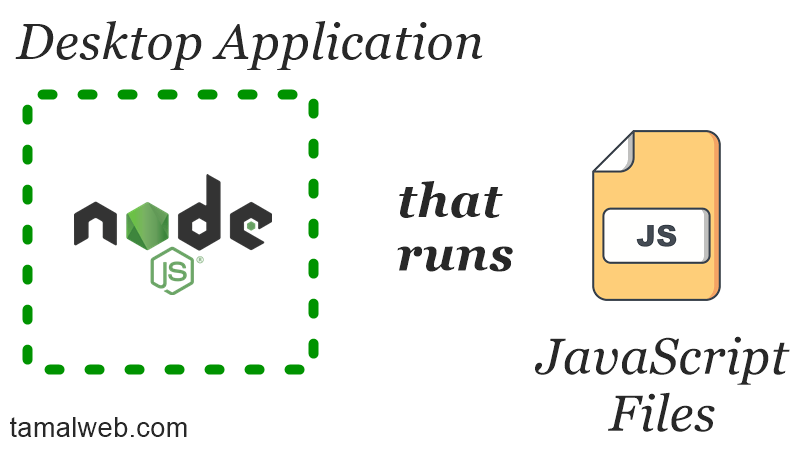

Node is often compared with other backend languages such as PHP and Python, but is it actually a language? Today I am going to answer that question once and for all.

Is Node JS a programming language? **Node JS is not a programming language, it uses JavaScript language as the main programming interface. Node is a desktop application (or runtime environment) that runs JavaScript files. It mainly reads and writes files on a computer/server and does networking.**

<!-- truncate -->

Node runtime can be compared to the JVM Java Virtual Machine or the IDLE Python interpreter. Whenever you want to write a program in a language, you have to install the software on your computer first. Think Node JS as that interpreter but for JavaScript files.

I often see people making a comparison of Node with other languages which then leads to silly fights between people that “you can’t make a comparison because it’s not a language” and all that. But when people do such comparisons, what they really mean is Node as the complete thing, and not just a language or the tool. So let me tell you a bit more about this runtime environment.

## What is the Node runtime environment?

Unlike other languages like Python, Ruby and Go, JavaScript didn’t have any kind of runtime environment. JS was made exclusively for the browser and it could only do certain things within the confinement of a browser like Chrome, Firefox, and Opera. As a result, we don’t have any print command in JavaScript, nor any file read & write option because JS doesn’t have any access to the computer’s file system. JavaScript was limited for doing simple page effects only. That changed when Ryan Dahl created the Node runtime environment (JSConf Europe, 2009).

The Node runtime environment is an application created in C++ which allowed the user to manipulate files on the computer. Dahl picked JavaScript as the programming interface for the Node runtime, and thus the name Node.js came (Dahl, 2009).

The Node environment was made similar to how the browser environment was made but with more capabilities so that we can make a web server out of it. This made it possible to write the backend of an application in JavaScript.

I won’t go in much detail of how exactly the Node runtime works, but I can tell you one thing that JavaScript gave Node a huge advantage when it comes to running a server and reading and writing files. The speed of Node JS made it possible to make efficient web applications and tools.

## Why JavaScript was picked for the Node runtime?

Ryan Dahl, the creator of Node, picked JavaScript as the language because it supports all the features he needed and a large number of developers already know how to write it. To build high performant server applications we should use the non-blocking event I/O model; luckily JavaScript is built in such a way that it already supports callbacks and events (Dahl, 2009).

https://www.youtube.com/watch?v=EeYvFl7li9E

To give you a clear example, let’s say I tell Node to write the user information in the database. Node will then send the request to the database. While the data is being written to the database, Node will not wait for it, instead, it will move on to the next task on the list. When the database gets back to Node, it will resume and do the appropriate action. This single attribute makes it possible to make faster and more efficient server applications.

Among other reasons, Dahl also mentioned that he picked JavaScript because it allows callbacks and has the option to supply functions as function parameters. JavaScript is a unique language and compared to other languages such as PHP, Java, and Python, it can do read-write operations much faster using a single thread.

By the way, Java and JavaScript are two different languages.

## Are Java and JavaScript the same thing?

They are not. Java is an object-oriented general-purpose compiled programming language. JavaScript, on the other hand, is a specific-purpose interpreted scripting language. The confusion happens for having the same name because when Java was popular, JavaScript was created to bring Java developers to the web (Netscape, 1995).

For simplicity, Java is a platform for making desktop, web, and mobile (android) apps, while JavaScript is used for making web applications.

Both languages have similar looking syntax because JavaScript was created based off of Java. The one difference between their syntax is: in Java, you have to define the type of the variable, while in JavaScript you don’t have to set the type of a variable. This is why JavaScript is called a weakly typed language and Java being the strongly typed lang.

What is the difference between browser JS and Node JS?
The creator of Node JS took the original JavaScript language and made a custom implementation to it. To start off, in the browser, the global object is called window, but in Node, the global object is called global. This is because there is no browser window in a Node environment.

Since Node is capable of reading and writing files, there is a global method require which can read and include files from the directory. There is another module called fs (file system) for doing all the input and output operations.

All the browser-related APIs like the fetch, localStorage, Notification is not available in Node because it’s not a browser.

Node made few custom methods but kept the same name as the browser for consistency; like the console.log, setInterval, and setTimeout could be named anything but wasn’t.

On top of that, Node has a list of built-in modules that can help the user build a server and do all the CPU and server related tasks.

## What Node JS is used for?

As you already know, Node is used for building server-side applications and this was the original plan. However, as time went on, developers found many new ways to use Node. Here are some of the prominent use cases:

### Node as a Full Stack Application

The best use of Node JS and the reason why I got into this was to be able to build full-stack web applications. Node is good for building all types of web applications. I made social networks with it such as the Twitter and Reddit clone. Other people have made SaaS applications, chat applications, and many different sites.

With Node, you can create the backend using a framework such as Express JS and build out the frontend with a view engine such as pug. Node renders HTML pages by dynamically generating them from the backend. It’s not just only limited to creating web applications, but you can also create just the backend of a server for any type of application.

### Node as the backend API

Another popular use of Node JS is making the backend of any other type of application. You can make an android or iOS app to have it as the frontend and then make the API server using Node.js. Node is good for making REST APIs that can be used on any type of front end. You can even make a desktop application with Java or C++ and have Node to handle the server endpoints.

Currently, I like to make the backend with Node and use React.js as my frontend client application. With that being said, did you know that the biggest use of Node JS is currently in the frontend?

### Node JS in the frontend

Being a server-side platform, ironically Node JS is now hugely used on the frontend.

But it’s not the way you are thinking.

Using Node in the frontend does not really mean you are running Node.js in the browser. You see Node is very good when it comes to reading and writing lots of files in a short amount of time. Developers have used this feature to build lots of frontend tools. Nowadays, most of the popular tools in frontend development are built and run by Node JS.

For example, webpack is a popular tool for minimizing JS and CSS files. Webpack does this on the fly using Node. The same goes for other tools like babel, gulp, browserify and many more.

And this is the sole reason why you have to download and install Node even when you are working in the frontend using React or Angular. Node JS is everywhere when it comes to building web applications. Even if you are not building a web application, you may still encounter tools that are built using Node.

## Advantage of learning Node

If you are ever going to build a web application, you will need to learn Node JS. The one big advantage of learning Node is that you will be able to port your skills from frontend to backend and vice versa. If you know how to use JavaScript to build server-side applications, you will find it easier to transition your way into the frontend. If you know how to work with frontend frameworks like React and Vue, you will find it easier to build backend APIs because it’s the same language. You can also reuse your existing code because both ends use JavaScript.

Since Node is the only tool out there for building the tooling and the backend services, you can make a good career being an expert in it. I am sure, over time there will be more and more uses of Node which you can benefit from.

## Final Thoughts

Node JS is not a language, it’s a runtime environment, but these days when someone compares Node with another programming language, they mean the entire Node JavaScript ecosystem. The Node ecosystem is huge and so much is happening around it so I suggest you pick one aspect of it, such as building full-stack applications and practice building lots of applications.

If you are interested to get started with Node, here are some tips for you:

- Learn JavaScript because Node IS JavaScript
- Pick one area and be awesome with it, build something
- Comment on this post and let me know what do you think of Node

## References:

1. Dahl, R. (2009). Ryan Dahl: Original Node.js presentation. Retrieve on April 9, 2020, from https://youtu.be/EeYvFl7li9E?t=796
2. JSConf Europe. (2009). Node.js by Ryan Dahl. Retrieved on April 9, 2020, from https://www.jsconf.eu/2009/video_nodejs_by_ryan_dahl.html
3. Netscape. (1995). Netscape And Sun Announce Javascript, The Open, Cross-platform Object Scripting Language For Enterprise
4. Networks And The Internet. Retrieved on April 9, 2020, from https://web.archive.org/web/20070916144913/http://wp.netscape.com/newsref/pr/newsrelease67.html
