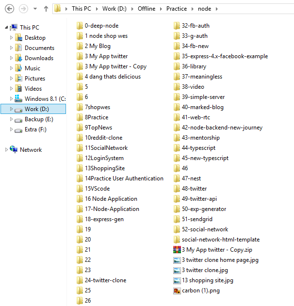
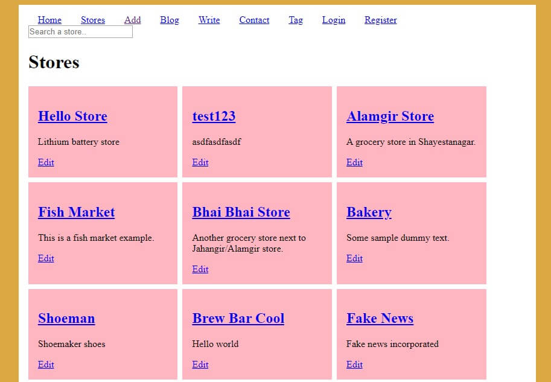
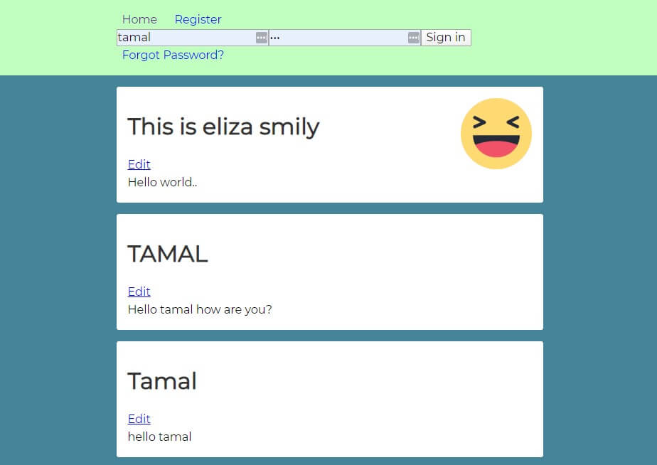
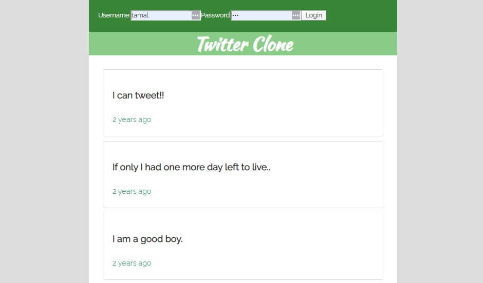
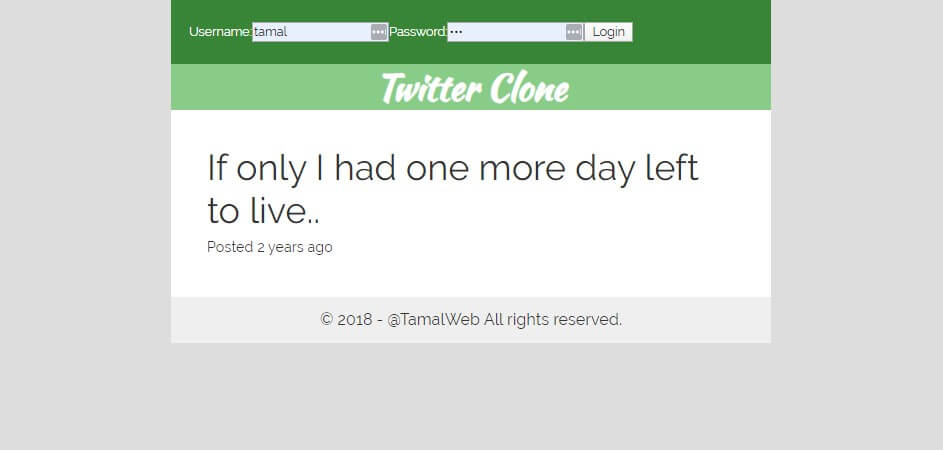
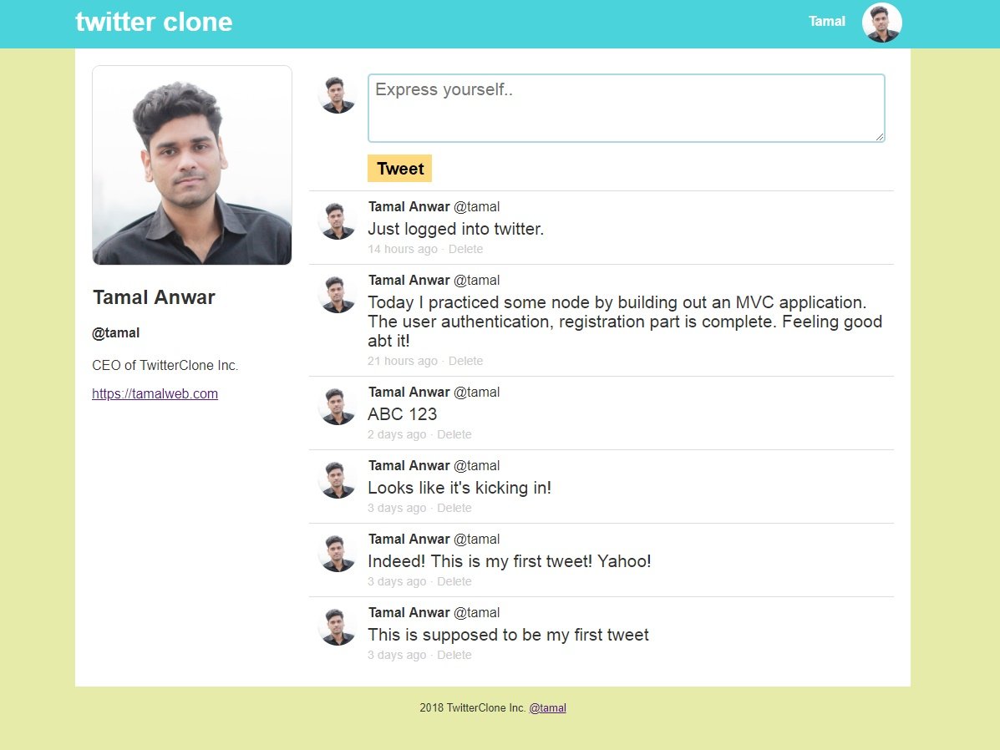
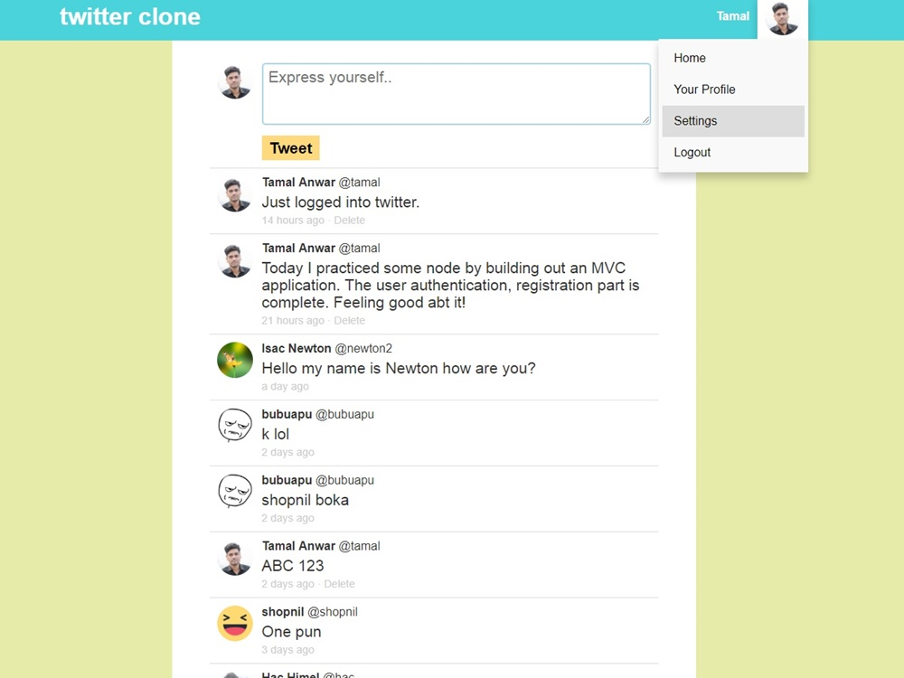

You are just getting started with web development and wondering how much time it takes to learn Node JS to be able to build something, like a social network, a chat application, or a SaaS to put it out there. Or maybe you are just wondering what are the skills you will need to become job-ready within a few months time. Well, my friend, you are in luck because today I am going to tell you exactly how long it takes to become a full-stack developer using Node JS sharing my own learning experience.

How much time does it take to learn Node JS? **It takes around 3 months to fully learn Node JS and be able to build a functional full-stack application. If you already know some other programming, you can get the basics down within a few week’s time.**

<!-- truncate -->

This is because there are so many moving parts that go into building a working app such as a social network. It took me a similar amount of time by following a video course that took me from a beginner to a pro in deploying web applications.

Of course, the actual time to learn anything solely depends on your personality, how much time you have available to commit to learning, and what kind of skills you already have that you can take advantage of.

## My skill level when I started learning Node JS

I started learning Node JS while having good web development skills in HTML and CSS. I didn’t have any prior JavaScript skills, other than taking a programming fundamental course many years ago. When I was taking the Node course, **I had no experience working with JavaScript and how backend development works**. So when I was learning Node, I was also learning backend development and JavaScript at the same time. It’s completely fine to learn JavaScript while you are learning Node JS.

I am going to assume you have a similar skill level that I had when I started learning Node and will write the rest of this article according to it.

## This much time I spent everyday learning Node

When I was learning Node JS backend development, I dropped everything that I was doing previously. As a freelancer, I didn’t have any job or study during that time so I put all my focus and effort into learning this new skill. I was watching videos and writing code all the time during the day. I recall that **I was spending roughly 4 focus hours in front of my computer every day for my Node learning**. This time includes watching the video lessons, taking notes and then redoing what my instructor was doing.

**To be honest, it was frustrating at times and I don’t recommend anyone to rigorously learn something like the way I did**. I wanted to learn Node JS as fast as I can so I took this painful route. As it turns out, it still took me 3 months to complete the entire paid course from Wes Bos.

The entire Node course that I took was only 10 hours in length, but it takes way more than that to fully understand and then implement each of the concepts.

:::warning A word on courses
Previously I adviced people to finish the entire course that you are taking no mater how long it takes, but it's only going to make you miserable, just like it made me. Instead pick out the parts of the course you are interested in and mix and match your learning.
:::

Prior to learning Node JS, I was a serial quitter. I took so many programming courses and failed to complete them so many times. So this time I was determined to finish what I started. But after I went through the pain, I had great results to show to the world.

## What I was able to build after learning Node JS

The course that I took taught me how to build a product listing site. This included user registration, logging in, posting user-generated content, and build REST API for favorites. I would make a new project from scratch the build out every feature I learned so far.

This is my node practice folder. Almost half of the projects I built during my initial three-month learning period.

I made practice projects that look like these:

As you can see, most of these practice projects were more geared towards social media sites, because that’s what I wanted to build. My first real project was building a Twitter clone out of my existing Node skills.

Twitter Clone
This was a fun project to do since I also learned how to deploy the project on the internet, and I quickly deployed it onto a free Heroku service to show it to the world.

After that, I kept on building other projects like the Reddit clone, APIs, and many client projects. It was great to see my hard work finally paid off and bringing fruits of my labor. I also started getting many job inquiries from many different companies for interviews (because I was sharing my work on the internet). I even got a job offer later that year (which I declined.)

Most of all, I was happy that this time I did not quit and now I have a valuable skill that allows me to build full-stack applications. If you are pumped up reading my Node journey, now let me give you some tips on how to learn Node JS efficiently.

## An efficient strategy for quickly learning Node JS

Node is a huge topic and there is a lot to cover. You can spend years and years learning about it and will still feel you haven’t learned it enough. This is why you have to be smart with your learning goals. Instead of learning everything, there is about Node JS, take a small portion, and be the best at it.

I had the goal to learn how to build a full-stack application with Node so that I can make social networks. I think you should also follow this path and learn how to quickly build a similar project. The fastest way to build a Node server is by using a framework called Express JS.

### Use Express JS to build your Node server

Express JS is the simplest and the most popular framework for building a server application with Node JS. With this framework, you can get a server up and running within a few lines of code. Basically express is a yet another custom module you will install in your application and use all the methods provided by it. When working with Node JS, you will find that you are installing custom NPM modules for doing almost everything. It is common in the JavaScript ecosystem to use other people’s code. In this case, these codes are bundled in NPM modules.

Express has many methods that allow you to create routes, controllers, set the view engines, connect to the database and many more built-in configuration that makes it easier for you to set up a server. You can even use an express-generator to start a project with boilerplate code. Building a server is simply creating routes that can handle various HTTP methods.

### Master the basic HTTP methods

When you are building a server, all you have to do is to create a few routes to handle some HTTP methods. The frontend of your application will talk to your server using these routes and the methods. Let’s say you have a home page that will list all the tweets posted by all the users. The frontend will request to GET all the tweets to the /all route in the server. The server will then load up all the tweets at that handler and send it to the frontend for displaying.

Similarly, you may have a textbox on your frontend that will send a POST request whenever someone posts a new tweet. The frontend will send that POST request to the /post handler in the server, that the server will respond to accordingly.

With backend building you are going to make routes that handle GET, POST, PUT, DELETE and other HTTP requests for making basic CRUD operations(Create, Read, Update, and Delete). If you can learn the gist of how these methods work, you will be set for 80% of the work required in Node. In fact, these are common among every other backend server programming.

Here’s a tip: You can build the entirety of your server by using just the GET and POST methods.

But above all, you should not worry about memorizing all the little things.

### You don’t have to memorize everything

Node JS backend development is all about setting up different configuration files. It took me a long time to realize that there is no point in trying to memorize different configuration options. You see with Node and Express development, you are going to use a dozen third party NPM modules. All of these modules are created differently and have different configuration options. I tried to memorize and test myself time after time only to get frustrated. The truth is, you will still do well if you just look up the documentation.

Here’s how I want you to approach this:

1. Decide what functionality you want to achieve
2. Search Google and find the best module for the job
3. Check their documentation or watch a video to configure it
4. Test that it’s working as you wanted to
5. Repeat the process

In the early days, feel free to rely on all the modules out there. Once you get to an advanced level and know how to work with the built-in modules, maybe you will write your own custom functionality. But most importantly, practice and build a lot of stuff.

### Practice and build a lot of projects

I practiced a lot when taking the node course. This is the key to learning and leveling up quickly. Don’t just sit there with your course project, build new things with what you already know. I built new projects from scratch every day that helped me practice my skills and build out a small portfolio.

Finally, don’t be afraid of putting out your work to the world. Learn how to deploy your project to the internet and show it to everyone. Sharing my work helped me learn more and get new opportunities. After finishing the Node course in 3 months, it was time for me to spend time building new projects. While building new projects, I got to learn even more stuff about Node JS.

Now that you have the tips to learn Node in record time, let me share some next steps for you to get started immediately.

## Next Steps

- Decide what you want to build with Node JS
- Check the [resources page](/resources) if you are looing for a node course
- Build lots of practice projects and learn from doing

## Comments:

**Chuks**: Hello, Tamal. Thanks a lot for your very revealing article. I stumbled upon it on Quora after going through lots and lots of articles on JavaScript/Node.js. I have to say that you sort of described my current predicament.

So, I am actually new to programming. I started with Python last year (my first programming language), but then I got frustrated midway when I couldn’t build anything with it, and so I left it. I took up JavaScript this year, and because I wanted to do backend, I also started learning node. I bought two courses on Udemy, one on JavaScript, and the other on Node.js (by Andrew Mead).

Just like you mentioned, I am learning them side by side. I know just the basics of JavaScript, but I do not want to waste any time so I began on node immediately. I’m only just about 23 videos into the course (The course has almost 350 videos). I can’t wait to actually build something just so I can see the fruits of my labor.

I would love to be in correspondence with you and also follow you on social media, just to get some tips and advice as I embark on this journey. Once again thanks for this article, and I have to say that it has motivated me. I hope I would be able to complete this course because I am now fed up of leaving things halfway.

> Tamal: Hello Chuks, thank you for your insightful comment and I am so glad that my journey motivated you to stick with it. JS is good because you can quickly build stuff that you can show to other people. This is an awesome way to keep you motivated while you are learning.
>
> Stick to your current Udemy course and try to complete most of it (if not 100%). For a large course that has 350 videos, you can take this shortcut: Instead of making it a task to view all the videos, you can review the section and learn the gist of the section. For example, if you have a section called REST API with 20 videos, you may learn the topic by viewing only 3-4 important videos from that and make it complete. You can always get back to other videos when you have finished a few practice projects.
>
> Thank you for wanting to stay in touch with me. Unfortunately, last year I deleted all my social media accounts and stopped broadcasting what I am working on. You can bookmark this site for new articles and also send me an email to stay in touch privately.
>
> See you on the comments!

**Mohit Kumar**: Hey, thanks for the tips. Just to give you a little background: I actually am a fresher who has been working in a company that uses dotnet technology. But the problem is that most of the stuff that is being used is older versions of the technologies. For instance, they have still not moved on to dotnet core and are stuck on an older version. Angular 1.7 is still being used which is quite old as compared to the latest version. Getting recruited directly from college, it wasn’t easy for us Freshers as the training the company provided was very bad for people who had no background in these technologies. Now 9 months on, I still feel I have not adjusted entirely. I had wanted to learn some new technology for the past few months now and I have recently developed an interest in learning Node js. So a couple of days ago, I started learning MEAN stack development mainly through YouTube. I am enjoying it at present, everything seems so great in Node. And I seem to be picking up the basics at least quite quickly. The only experience of JavaScript I have is with angular that we use in our current company.

Now coming to some of my questions, what do you have to say about working with dotnet technology from a career perspective? And should I learn Node js by myself for a few months and seek a job in MEAN stack technology? How much scope does Node/MEAN stack have from a career perspective and from a versatility perspective in building different types of applications?

> Tamal: Hello Mohit, thank you for your comment. I understand your need to work with the latest technologies. You have to find some time out of your job and build a few side projects with the MEAN stack. As for the career perspective, I still don’t have in-depth industry knowledge so I can’t say for sure. But what I have seen so far, technology stacks change all the time.
>
> Ruby on Rails was all the hype, now it’s Node, then it will become Golang. Just because it’s not the hype, doesn’t mean people don’t use RoR anymore. In this industry, you have to learn a lot of technologies over your lifetime so learn how to build great software and don’t focus so much into specific tech stacks.
>
> And about dotnet, I don’t want my opinion to change your mind. It’s a good technology and I am looking forward to moving towards .NET sometimes in the future, but for now, I am going to master Node JS and build a few projects until I become fully satisfied. dotnet here is the variable, any technology that solves the business problems is valuable. Learn how to solve business problems with technology and you will have better career opportunities.
