You probably know about the react-ga npm package but the sad news is, it does not work with the latest Google Analytics 4 version. It works with the old `UA-0000-01` tags, but not with the `G-XXXXXX` tags. I’m sure an updated version of the package will solve it, but for the time being, I found a better and a working method of adding GA to your React application. And it’s so obvious, you will feel like, "why didn’t I think about it before?"

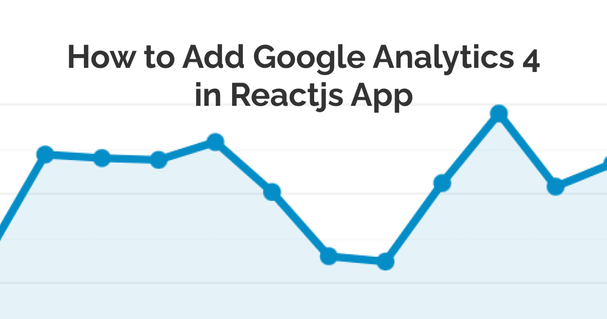

So how to add the new Google Analytics 4 in Reactjs app? **You simply copy the Google Analytics script tag into the `<head>` section of your index.html file in the public directory.**

Yeah, I know right, it’s that obvious. I found it by trial and error. If you stick around, I will show you a step-by-step guide and also give you a glimpse at how did I figure it out.

<!-- truncate -->

## Step-by-Step Guide to Adding Script Tag in Reactjs App

Create a new property in Google Analytics.

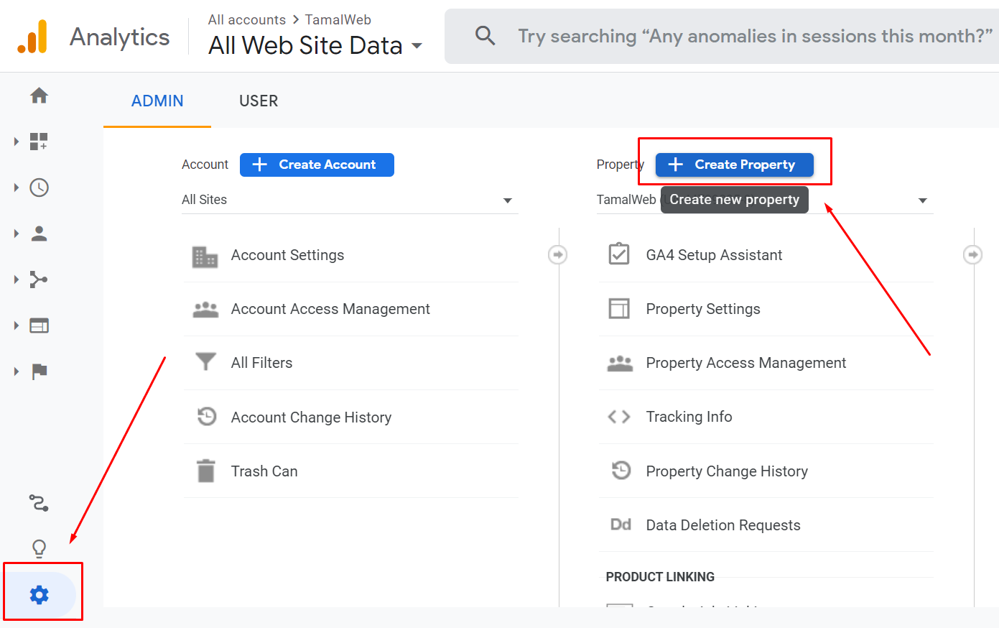

Don’t select advanced and Universal tracking. Just click next.

Enter the usual business info and move on to create.

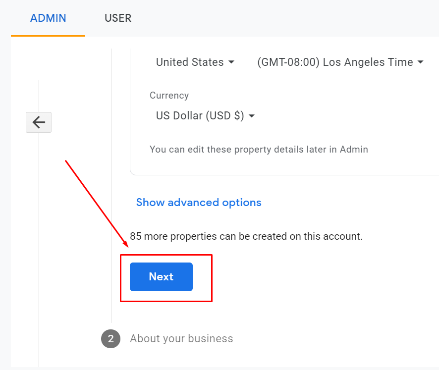

Now after the setup, pick the “web” data stream.

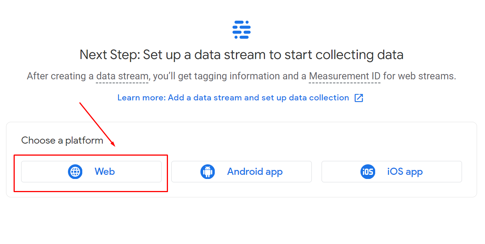

Enter your website URL and continue.

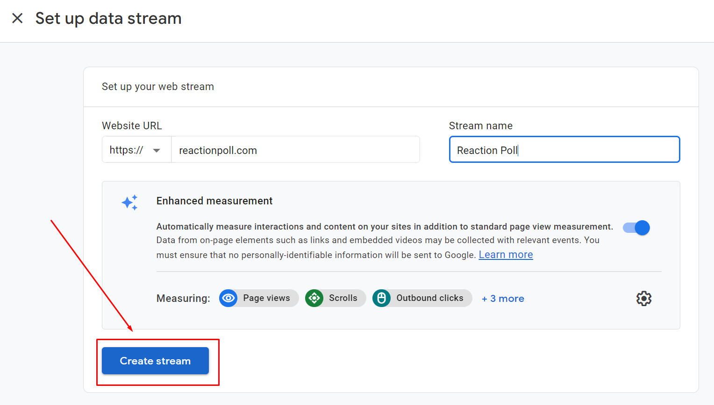

Select the Global site tag (`gtag.js`) option and

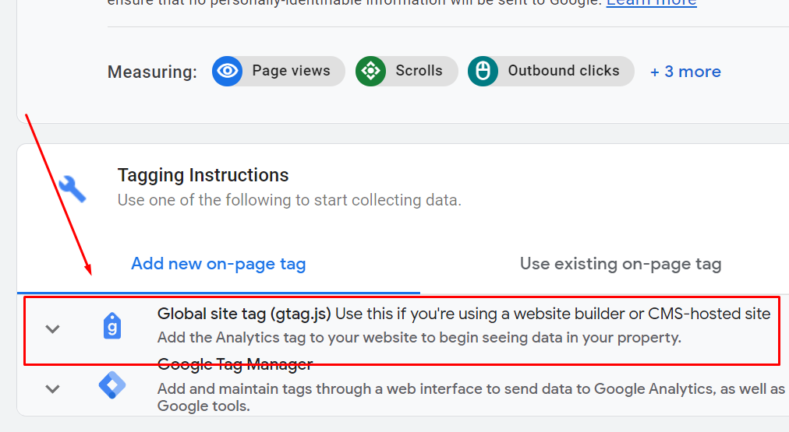

copy the code.

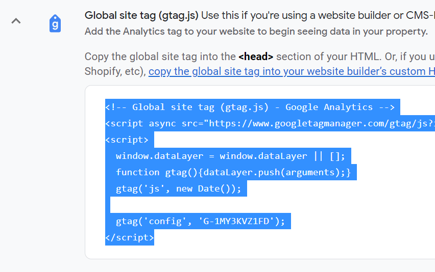

Open your React project directory. For me, I created the app using create react app. Go to public > index.html.

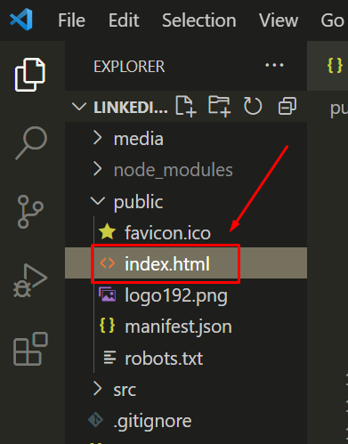

Put the GA script tag inside the `<head>` tag. I am putting this as the last item of the head tag, after the site title.

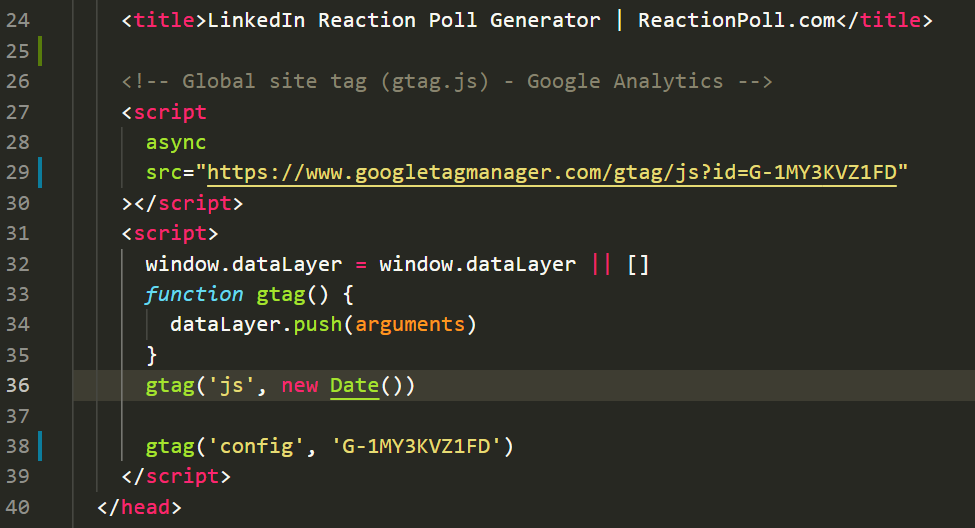

Build your project and publish. For me, I have set up my project in Netlify with GitHub CI. So every time I push the changes to my Github main branch, it will be deployed automatically.

Now visit your website from your browser or mobile device and verify that Google Analytics is registering the views. If you can see the views, that means you have successfully set up your analytics with the React app.

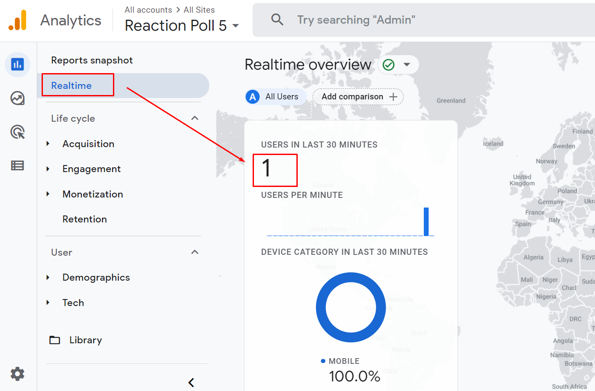

## How To Track Custom Events in Reactjs App?

If you want to track custom events you can use this npm package [ga-gtag](https://www.npmjs.com/package/ga-gtag) which integrates Google Analytics 4 with your Reactjs application.

Recently I created a [poll maker app](https://reactionpoll.com/) and I wanted to know how many people downloaded the polls using my app.

GA custom events come in handy for this type of tracking. [Learn more about custom events from GA website](https://developers.google.com/analytics/devguides/collection/gtagjs/events).

```js
gtag('event', 'download_poll_image', {
  poll_title: 'some value',
})
```

Previously we added the GA script tag into the head section of our index.html file, but we can’t use gtag inside our JS file because it’s not defined. This is where this handy package comes in.

Just install the package using npm install ga-gtag and import it into your project file where you will be tracking the event.

```js
import gtag from 'ga-gtag'
```

Now since I want to track the image downloads, I will add this custom method inside my image download function.

This is how the gtag event function looks like:

```js
function trackDownloadEvent() {
  gtag('event', 'download_poll_image', {
    poll_title: 'some title',
  })
}
```

See I have named the event `download_poll_image` and inside I am tracking the `poll_title` parameter. This way, I will know how many times a new image has been downloaded and what were the titles of the polls that are generated.

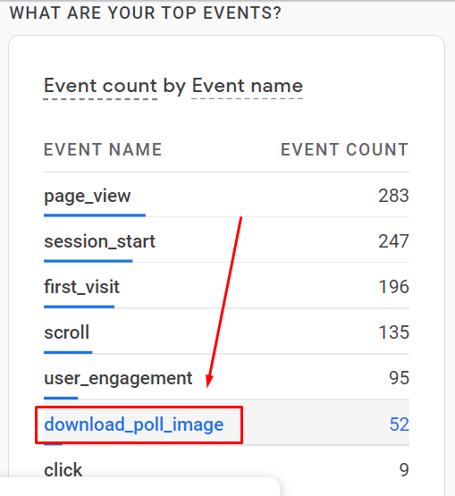

:::tip Side note

When I used this package to install the gtag instead of pasting the script tag, I was not receiving any data for new users. That’s why I decided to manually copy-paste the script tag and use this package just for tracking custom events.
:::

## How to See the Custom Even Parameters in GA Dashboard?

One issue I ran into was, the custom event parameters don’t get saved in Google Analytics 4. So I can see all the `download_poll_image` events, but not the individual poll titles. I did some Googling and found that it will only show up on the real-time pane (not good).

So to make GA save these parameters, you have to mark that event as a conversion for it to store all the parameters you want:

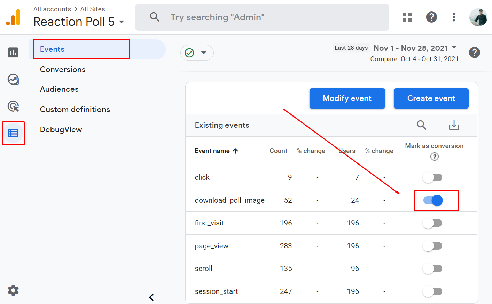

Now Analytics will keep them.

If you have come to the end of this post and it helped you with setting up Google Analytics with your React app, then please let me know by tweeting about it.

It tells me that I have done a good job and will inspire me to share more cool stuff in the future.

## Key Takaways:

- Add Google Analytics tag simply by pasting into the head section of index.html page.
- The react-ga npm package still doesn’t work with the new `G-XXXXX` tags.
- Use gtag npm package to track custom events.
- To persist the custom event parameters, you have to instruct GA.
