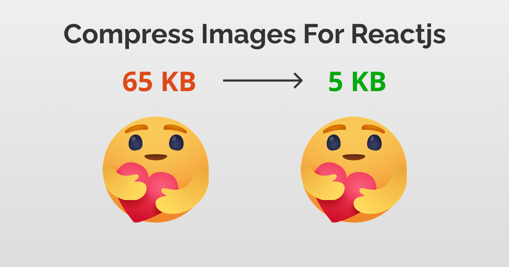
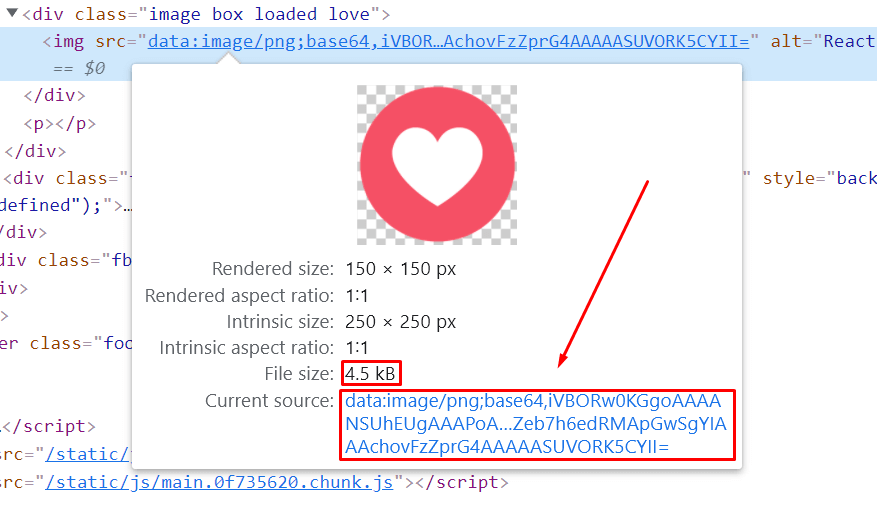
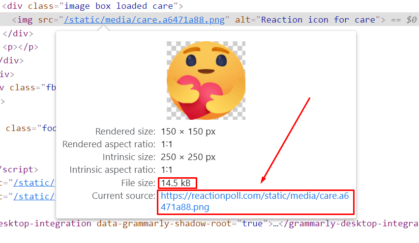
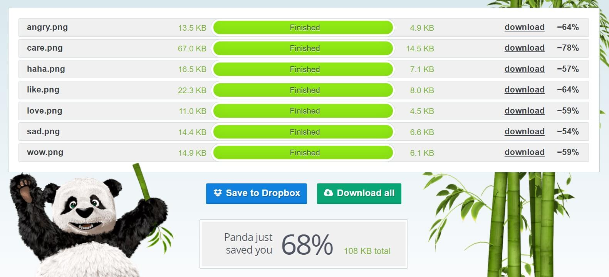
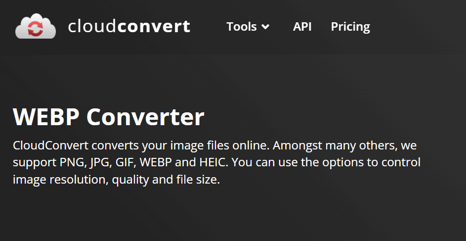
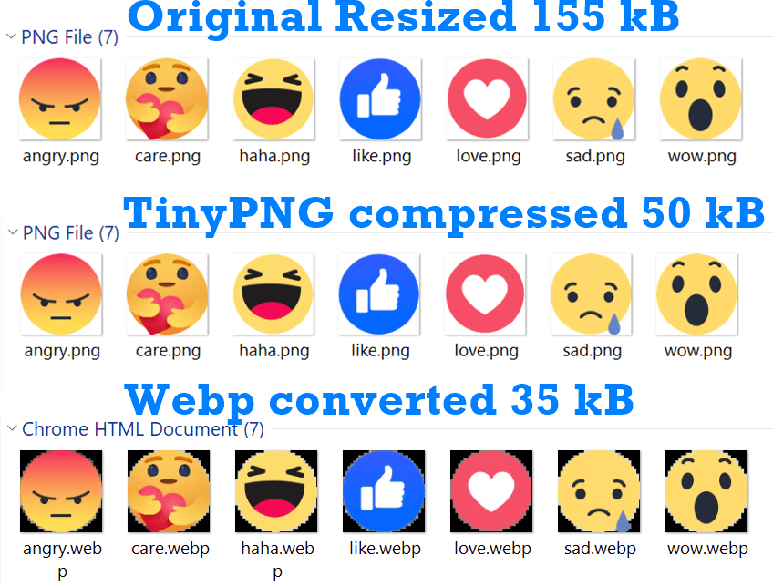
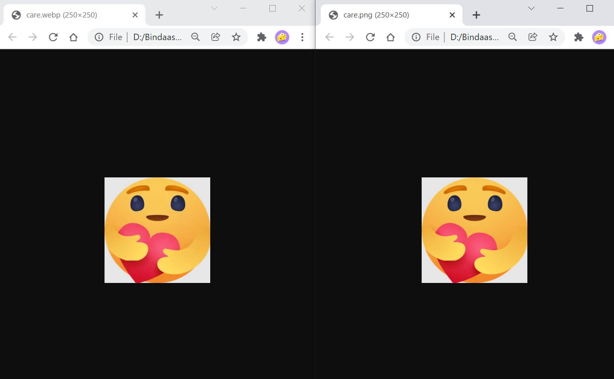

In this quick tutorial, I will walk you through some of the best ways you can compress images for Reactjs for huge performance wins.



As you can see on the cover image, the original file was 65 kB, and after compression, I got it down to 5 KB, that’s over 80% saving for just one image file.

This file is from one of my side projects ReactionPoll, where I make use of a bunch of Facebook and Linkedin reaction icons. My original reaction set for Facebook was 155 kB and after optimizing them, I got it to just 35 kB!

<!-- truncate -->

Let’s begin with the obvious,

## Import images into your React source code

The first quick win is to always import your images in your source code.

Add the images into the src directory. For me, I created a folder called img inside the src folder and put all the image assets inside.

Now from your component files, just type in

```js
import like from '../img/src/like.png'
```

You can insert this image in the src attribute in the img tag like this:

```js

```

When you import images this way, create-react-app (or webpack) will bundle all your images and try to best compress them.

:::warning Note

Don’t put your images in the `/public` directory and hotlink them, unless you have a strong reason to do so (Hadar, 2021).
:::

If your images are less than 10 kB (10,000 bytes) these images will be converted into inline base 64 strings. So they will load instantly (Llobera, 2020).

See this love icon is 4.5 kB (less than 10 kB) and converted as a data URL:



But when your images are over 10 KB, for example, this care reaction icon is 14 kB, react will link to the asset file.



Did you know about the inline image thing? I didn’t. Tweet this to your followers,

:::tip
If your image is under 10 kB, Create React App will turn them into base64 data strings, making them load instantly!
:::

To further compress these source images, we have to optimize them ourselves,

## Compress Your Source Images Using TinyPNG

TinyPNG is an online tool I use to compress images. Usually optimized PNG and JPGs have a small file size already, but when I run these images against this free tool, I get surprised that it squeezes up even more.



I saw a 68% savings when compressing my reaction icon pngs using TinyPNG.

Compressed JPG and PNGs can only take you so far. If you want to really up your compression game, you need to find an even better image format: webp and avif.

## Use Webp/Avif Images for Even Better Compression

Webp (weppy) is a new fast image format developed by Google. If weppy is fast, then AVIF is faster. In my ReactionPoll tool, I used weppy images to further compress my images.



What I did was to replace all images with their webp counterparts.

There is a weppy converter tool called cwebp that I downloaded and installed into my computer, but I was too lazy to compress them in CLI. So I used an online converter to convert my existing PNG files to webp.

The weppy versions helped cut down around 20% more file sizes from my already compressed PNG files.

You should keep in mind that, weppy and avif are newer file formats and not available in older browsers. It’s a good idea to serve webp but also fall back to the jpg/pngs.

## Use Webp and PNG together with Fallbacks

Using the `<picture>` tag we can add both webp and png files. The browser will pick the image that it supports.

The tag looks like this:

```jsx
import likePng from '../img/src/like.png'
import likeWebp from '../img/src/like.webp'
;<picture>
  <source srcSet={likeWebp} type="image/webp" />
  
</picture>
```

I learned how to use this trick + how to use a reusable react component to automate the process using Josh’s blog post.

Basically what he did was create a component called `ImgWithFallback`

```jsx
const ImgWithFallback = ({
  src,
  fallback,
  type = 'image/webp',
  ...delegated
}) => {
  return (
    <picture>
      <source srcSet={src} type={type} />
      
    </picture>
  )
}
```

This component will take the webp image as the src and the png as the fallback image.

Use webp/avif images for faster loading but also have a fallback to png/jpeg files using a `<picture>` tag.

After adding the WEBPs, I can say my images are loading much quicker than PNGs.

## My Results

I started with original reaction icons that I downloaded from the internet. After resizing all the icons into 250×250 png images, the total file size for the seven icons was 155 kB.



After compressing the PNGs with TinyPNG service, I ended up with 50 kB file size for all of them.

Finally, when I converted them to webp file format, I ended up with 35 kB file size, that leaves 5 kB per image icon.

Now you must be looking at the picture above and thinking, why the weppy images look pixelated? I don’t know why it is displaying like this on my computer, but when I open both icons side by side, I can say they look fine,



By the way, all these icons you see are part of my Linkedin and Facebook reaction poll generator. If you want to check out my project in action and how the images perform, visit ReactionPoll.com/facebook

## Final Thoughts

Image compression and performance optimization is ongoing thing. As time goes, we will surely find out more ways to shave off those extra kilobytes without compromising the quality. When that happens, I will update this article with newer tricks as I learn them.

Till then start optimizing your react website and send me a tweet if you found this post useful.

**To recap what we learned so far:**

- Always import your images in reactjs
- Compress your assets using a tool like TinyPNG (it also works with jpegs)
- Use webp and avif image formats for fast loading but also have fallbacks for the browsers that don’t support them

## References

1. Hadar, A. (2021) Using the Public Folder, Retrieved December 4, 2021, from https://create-react-app.dev/docs/using-the-public-folder
2. Llobera, L. (2020) Adding Images, Fonts, and Files, Retrieved Decmber 4, 2021, from https://create-react-app.dev/docs/adding-images-fonts-and-files

## Comments:

**Cindy Lam:** Hi Tamal, This is such a great and well-written article. I can tell you put a lot of effort and thoughts into writing this blog post. I really like the flow of the entire post. The use of screenshots and images are really helping you to tell your story. To me, as a reader, I do not feel exhausted reading through it and I even get some surprises like the “tweet” option for me to easily tweet what I have learned from your blog post to others. Fast and convenient! More importantly, I really like the “table of contents” and the recaps at the end of the blog post.

Here are some of my opinions and suggestions that hopefully can help you out to improve the current blog post (I am just writing down what I hope to see as a reader when reading through the blog post):

(1) The “Care Reaction” icon compression results in using TinyPNG and Webp methods – I know you have displayed screenshots regarding the file size of the care reaction before compression. I think it would be helpful to see this throughout all the other sections to see the progression of the compression. It gives readers more excitement when they are able to see the result immediately after reading sections 2 and 3.

(2) Included the “Can I use” link for Webp and AVIF – ie, [can i use](https://caniuse.com/?search=webP%20image%20format) so the reader can click on the link and directly see the browser compatibility of these two image types.

(3) For Josh’s blog post, I think it would be best if you could just link directly to the [“Abstraction with React”](https://www.joshwcomeau.com/performance/embracing-modern-image-formats/#abstraction-with-react). As a reader, I do not need to scroll all the way down to the source code.

The above items are just my opinions and hopefully, they can be slightly helpful to you if you are looking for optimization.

By the way, I have found a small typo in section 3 the last paragraph right after the bold text, you have Webp spelled incorrectly.

Overall, I really enjoy reading this post and learning something new regarding image compression! Great post, Tamal!

> Tamal: Hey Cindy, thank you for a very thoughtful comment.
>
> Let me write some quick responses to your points below:
>
> 1.  You are right. Gonna update with some more before/after screenshots.
> 2.  Good idea! I am gonna put them.
> 3.  Sure, will add the direct link.
>     Typo: I intentionally wrote Weppy -it’s like a human-friendly >name of the technical WebP.

**Jose Oropeza**: Excellent article Tamal. I honestly never considered image compression but will surely give this a try on a future project, specially since image quality is not compromised. Would love to see an article on best practices for optimizing gifs.

> Tamal: Definitely! Google web dev recommends web video in place of gifs to save data. But I’ll def look into it.

**Christiaan:** So if I understand it correctly all images below 10k are in lined. So in the last step both the PNG and webp are in lined.
So aren’t you shipping 35Kb more in the last example?

> Tamal: Only pngs are getting inlined, so in the last step, I am keeping both webp and png because of backwards compatibility.
