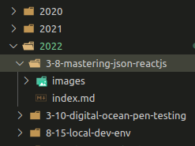

This is not a 'how to' post but an answer to a frequently asked question. My blog was originally made with WordPress. I came across [Docusaurus](https://docusaurus.io/docs), an open-source static site generator for documentation sites. I thought of using that for my blog because my tech blog also works like documentation.

The best part is, all the pages are statically generated and they load up instantly with a click of a button. Docusaurus is built on top of React and JavaScript, so it's yet another reason to use it.

<!-- truncate -->

I set up a demo site following the instructions and one by one, copied all the posts from my WordPress blog to the new docusaurus site.

I could have saved this time by automating this process. [John Reilly](https://twitter.com/johnny_reilly) has a guide on [how to automate this process with a typescript script](https://blog.johnnyreilly.com/2021/03/15/from-blogger-to-docusaurus). His method is to export your blog in XML format (WordPress also does that) and then import them to Docusaurs with a script written in TypeScript.

When creating a docusaurus site, your articles will be stored in a directory like this:



I put them by year. I create a directory per blog post because I wanna have a dedicated `images` folder to call for images.

All the blog posts are written in a [unique flavor of Markdown, MDX](https://mdxjs.com/). With MDX it is possible to import additional React components to make an interactive blog experience.

For the blog post meta, there is this special **front-matter** syntax you can use. The front matter handles the title, slug, tags, and author information.

```mdx
---
title: Mastering JSON in ReactJS
slug: json-reactjs
authors: tamalweb
tags: [reactjs]
image: ./images/feature.png
---
```

Since I am the only author of this blog, I set my info into the `authors.yml` file. Whenever I set this author username, it will call what's in the yaml file.

```yml
tamalweb:
  name: Tamal Chowdhury
  title: Software Engineer
  url: https://tamalchowdhury.com
  image_url: /img/tamalweb.jpg
```

Docusaurus is open source, and so is the code of my blog. You can find the [entire code in this repository](https://github.com/tamalchowdhury/tamalwebsite).

I have hosted this blog on [Netlify](https://www.youtube.com/watch?v=aJVKKbisM0w). Every time I make a new update to the `master` branch, Netlify will rebuild the site and host it on their awesome server for free.

Finally, when it comes to SEO, I haven't done anything out of the box. I make my blog articles' title SEO friendly, and the slug human friendly. Every time I write a new post, I try to tag them and link to and from other relevant posts. There are some long-form blog articles I wrote following the [Project 24 SEO method](https://www.youtube.com/watch?v=9jLo89V_q3g).

I think that's about everything about my blog. If you have any additional questions, then send me a DM or [tweet me @tamalchow](https://twitter.com/tamalchow) and I will update this post with the answers.
