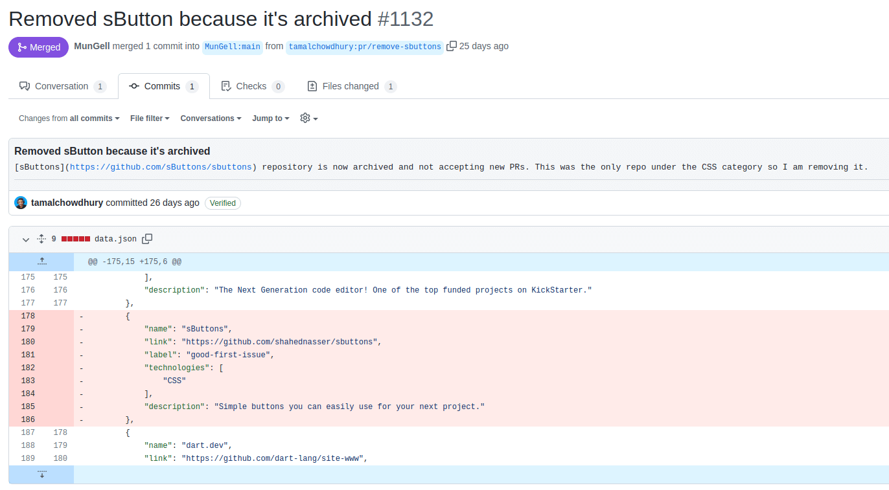
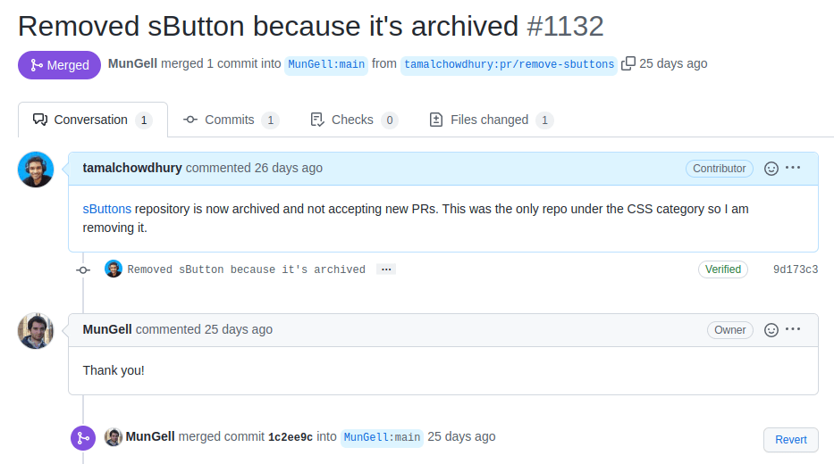

If you are like me, I had a GitHub account since 2014 and have been dumping all my projects into the profile ever since. But I didn't do anything beyond that.

I am a competent engineer, but when it comes to working with open source, I have no clue what that is. I tried many times trying to learn, but failed.

In October 2022 I participated in the annual Hacktoberfest. This was my first time getting involved in open source. As of writing this article, there are just 7 days left for this year's hackathon. This article will help you participate in open source in general even after the event is over. So let's get started:

<!-- truncate -->

Okay, so a good way to learn something new is to just dive into the topic and get comfortable doing it. 

But where do you start? I watched [this video from Kent C Dodds on how to contribute to OSS](https://egghead.io/courses/how-to-contribute-to-an-open-source-project-on-github). This course covers the technical parts pretty well. You should definitely check it out to get your Git setup.

Now here's the golden question: Which repository should you contribute to? Kent again has a blog post about [which open-source project you should contribute to](https://kcd.im/what-oss). The summary of his message is, **you should contribute to the things you use on a daily basis**.

So I started to make a list of all the projects I use. Mostly the NPM packages I use on a regular basis like express, axios, moment, etc. I also found [this excellent repo with a list of open-source projects](https://github.com/MunGell/awesome-for-beginners) you can contribute to. Looking into the repo, I found a lot of familiar names. I went to many of these projects and tried to understand the repo by reading the README, the issues, and pull requests tab. 

I gotta say I am not good at reading so it soon bored me. I found these two projects cdnjs and Brave browser interesting so I looked further. 

Once I found a few interesting projects to work on, I started using the GitHub web interface. The contributions I want to do are many low-hanging fruits. I want to be familiar with the entire Git workflow with low-effort high-reward activities.

## How Not to Spam when Contributing to Open Source

When I say low-hanging issues, I don't certainly mean adding a space or a tagline to documentation and calling it a contribution. No, this is spam.

If you take a look at [shittoberfest twitter](https://twitter.com/shitoberfest), you will find out what are some of the spam contributions people make. When starting open source, you don't wanna send a bunch of spam towards a repository and ban you from the account.

The point is, your contribution should be thoughtful which helps the overall project.

Below, you will find a few of my low-effort contributions to get an idea of what kind of contributions you should do (click on the link to see the full commit information):

[Removed sButton because it's archived](https://github.com/MunGell/awesome-for-beginners/pull/1132)

[Add microdiff library to cdnjs](https://github.com/cdnjs/packages/pull/1366)

[Update documentation for JS Beautify](https://github.com/beautify-web/js-beautify/pull/2107)

[Adds facebook open graph tags to 2 files](https://github.com/theritikchoure/carrierjs/pull/6)

Now let me show you how you can contribute to open source using the GitHub web interface,

## How to Contribute with the GitHub Web Interface

GitHub's web interface is excellent for contributing to open source when you are just getting started. You can fork projects, make pull requests, comment, upload files, and many more. If you are just starting out like me, you should definitely give the web interface a shot. The [contributing guideline from cdnjs](https://github.com/cdnjs/packages/blob/master/CONTRIBUTING.md#make-changes-to-your-fork) even encourages people to contribute a package using the web interface when making a single commit.

While reading the [list of cool open-source projects](https://github.com/MunGell/awesome-for-beginners),

I [found a project listed](https://github.com/sButtons/sbuttons) under the CSS section. So I went there and saw this project is not maintained anymore.

Removing this project from the list would be a great start to OSS. If I remove it, other devs won't have to spend their time exploring a project which is already archived.

So I removed the item from the readme file and created a new pull request.

Unfortunately, there was a red **Invalid** mark next to it. 

GitHub has these actions setup by the project maintainers. 

In my case, the automated script checked and saw I did not edit the correct file.

Going back to the `contributing.md` file, I learned that I must update the `data.json` file instead of the README file. The readme will be auto-generated from the json. 

**Lesson learned. Read the contribution guide.**

I deleted this pull request and made a new one following the process.

The overall process of making a pull request looks like this,

:::info
Please don't copy paste my commits, just use it as a guide to contributing in general.
:::

Fork the repo you want to contribute to.

Go to your version of that project.

Make changes to the files by clicking the pencil button, or add new file.

In this case, I changed the `data.json` file to remove the sButton project from the list.

After making the changes, commit them by filling out the form,

- Write a compelling title for your PR. 
- Add a detailed description explaining **what you did** and **why you did it**. 
- Create a new branch name to identify your change like: `pr/your-change`.

Commit the new change by clicking the green **Propose Changes** button.

After you click this button, you might see a green button to create a pull request, but don't. Clicking this button will just create a pull request into your own copy and not to the project you want to commit to.

Now go back to the original project by clicking the small link under your project url:

Now over here, you will see a new button for you to **Compare & Pull Request**. 

Click on it and you will be presented with another window to commit your changes. This time, it will be auto filled with your commit info. If you wish, you can edit your commit message and description.

For my commit, I described the change I made and submit the request.

Now I can go to the pull requests tab and see my PR.

This time, my PR was not marked as invalid and it was waiting for review from the maintainer.

Within a day or two, I received an email from GitHub that my PR was accepted and merged into the code.

And just like that, I made my first contribution to an open-source project. It was a minor edit, but I got to learn the entire GitHub work flow.

In the following days, I started exploring cdnjs and trying to contribute to some more code,

* * *

I have some more sections written for this tutorial. 

For time shortage, I was only able to publish this first section. Be sure to check back later or [follow me on Twitter](https://twitter.com/tamalchow) to stay updated on the next parts. You can look at my contributions in open source [on my Github profile](https://github.com/tamalchowdhury).

To be continued...

