I am learning pen testing and ethical hacking as a hobby. When doing pentesting, it's common to setup a local Virtual Machine (VM) using Virtual Box to setup the attack boxes. However, one issue I face regurlary is how slow each of the tool installation and scaning takes. Since local VMs rely on my internet speed, often it takes a lot of waiting time for scanning outside servers.

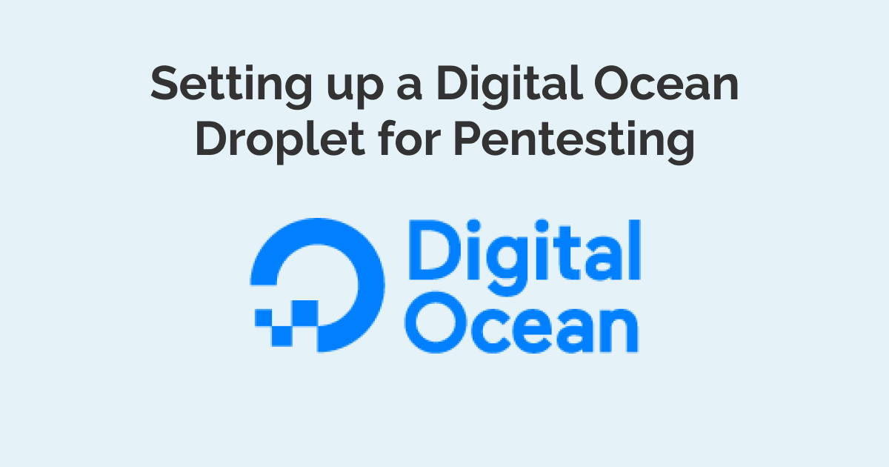

Then I realized I can use a VM from a VPS provider such as Digital Ocean and use it for external pentesting. By doing so, I can use a faster CPU, RAM, and of course, fast internet speeds. Working with a commercial VM will help you speed up your processes when connecting to public servers like [HackTheBox](https://www.hackthebox.com/) or [PentesterLab](https://pentesterlab.com/).

In this article, I will walk you through setting up a pen-testing attacker machine with Digital Ocean.

<!-- truncate -->

## Setting up a Digital Ocean Droplet (VM)

To use the droplets, you have to sign up for a Digital Ocean (DO) account. DO offers [free credits from $100-200](https://m.do.co/c/c19340f2e4a7) that you can use for the first two months (this is my referral link). I say this is a great way to try out the product without paying the full price.

After signing up, create a new project.

I am naming my project **pentesting-1**

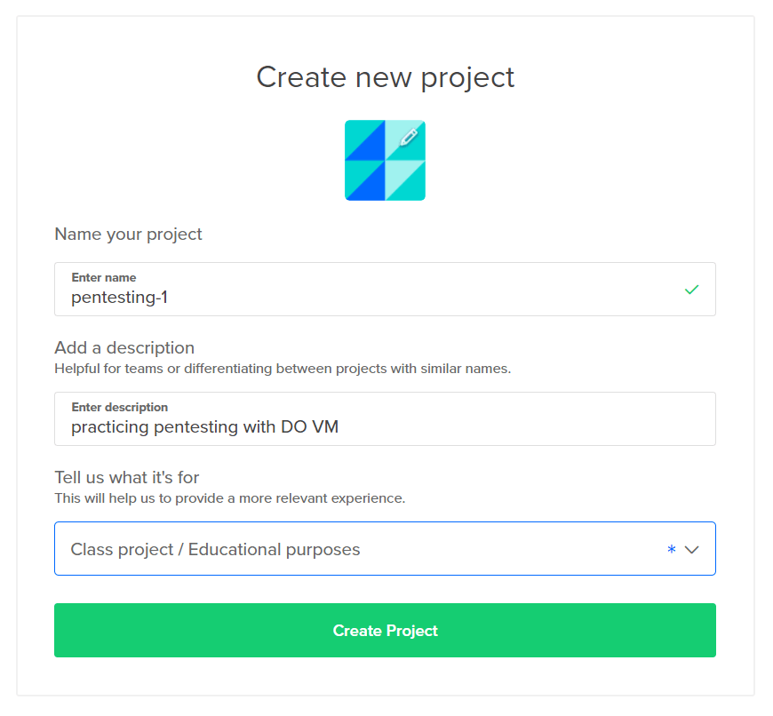

After creating the project it's time to create a droplet. In Digital Ocean, a VM is called a droplet.

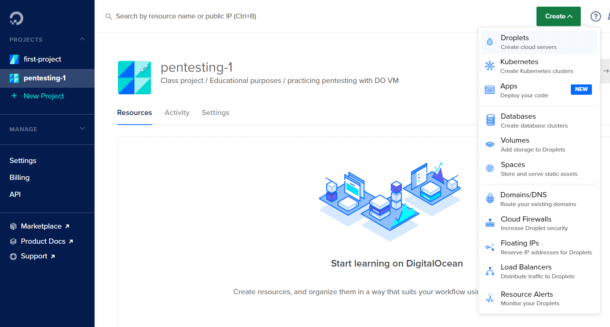

On the droplet creation page, you can choose from a range of Linux distributions. If you are experienced, you can install a custom image like Kali, or use the barebones Debian. For this article, I will stick to the basics with Ubuntu. I am choosing Ubuntu because it's a well-known Linux distro with lots of tutorials on the internet.

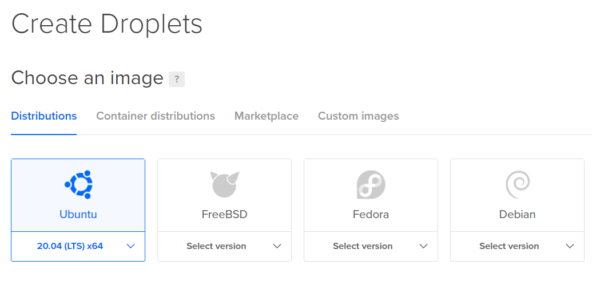

With Ubuntu, we have to manually install all the pen-testing tools as we go. This is a great exercise in working with packages in Linux.

Pick a plan for your droplet. The $5/mo basic droplet is enough for beginners. When you gain more experience and need more horsepower, you can create bigger droplets.

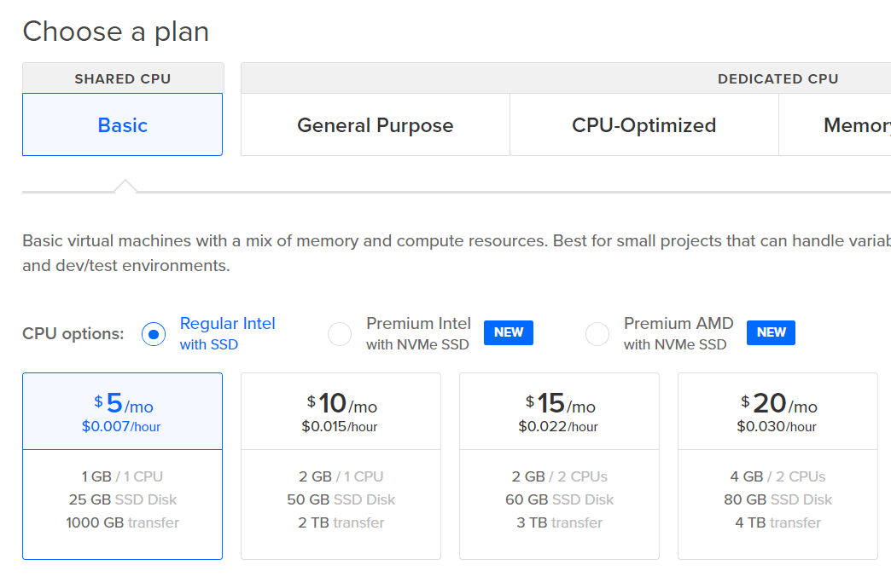

Choose the closest data center location for your droplet. Since I live in Bangladesh, I am picking the Bangalore data center. By picking a close server, my data will take less time to travel. This will result in a faster user experience.

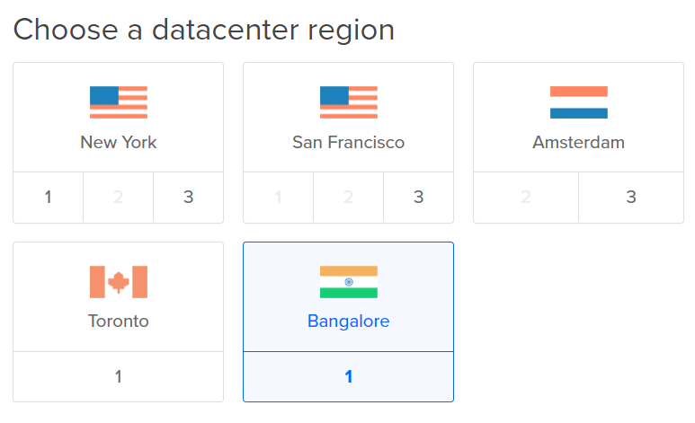

For authentication, it is recommended to set up an SSH key. But to keep this post simple, I will just use a password to login into the VM. Make sure to store this password somewhere safe. I saved it in my LastPass account.

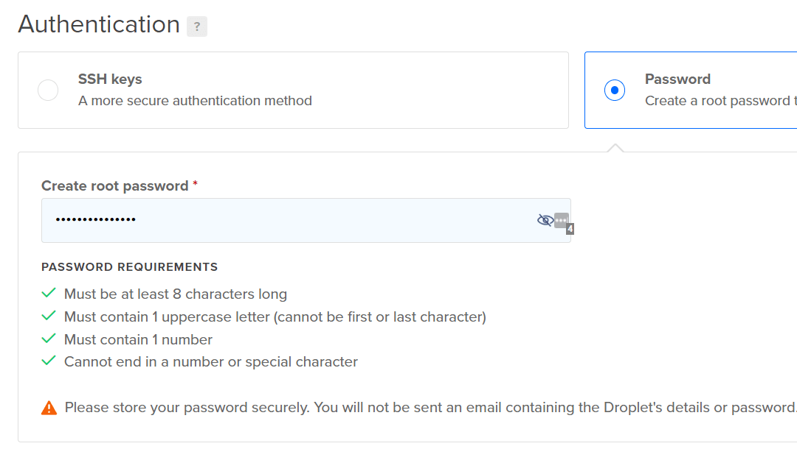

I don't need to pick any additional options.

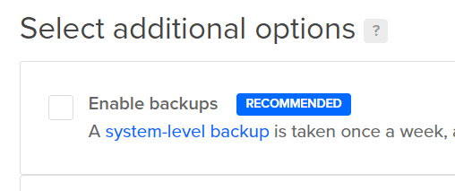

I finalized creating the droplet by clicking on the big green button.

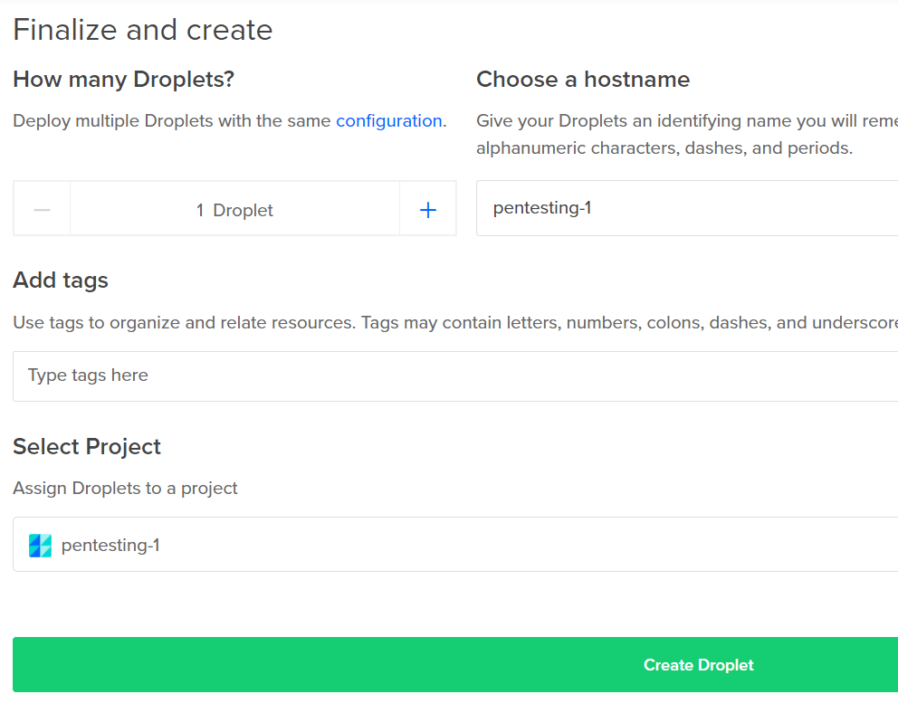

Now there is a droplet in the dashboard. This will also display the public IP address which I will need to log in in the next section.

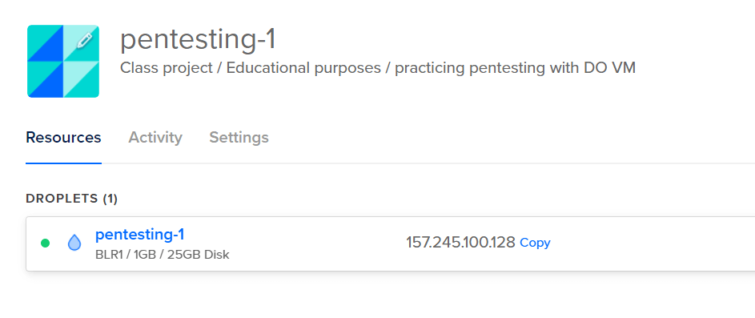

Next, I need to log in to the droplet.

## Logging into Digital Ocean using SSH

To log in to the droplet I created, I will open up my terminal. I am using VS Code, so I am going to use the Bash terminal. If you want to know [how to set up Git Bash in your Windows environment, check out my YouTube video](https://www.youtube.com/watch?v=nLue1WsetbE).

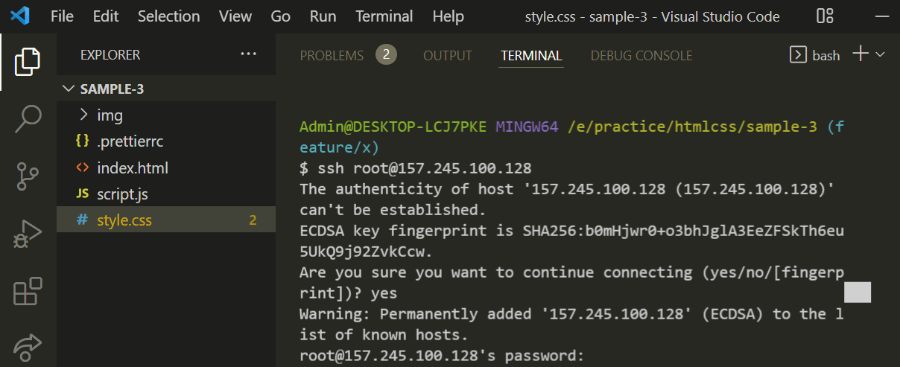

Enter the ssh login command,

```bash title=Terminal
ssh root@<IP ADDRESS>
```

Since I am not using an SSH key, it will warn me if I trust this remote machine.

I will enter `y` to confirm I understand and trust this host.

Next, it will ask me for the password. This is the password I set in the droplet creation section (not my Digital Ocean account password).

After entering the password, I will be greeted with the Ubuntu welcome message.

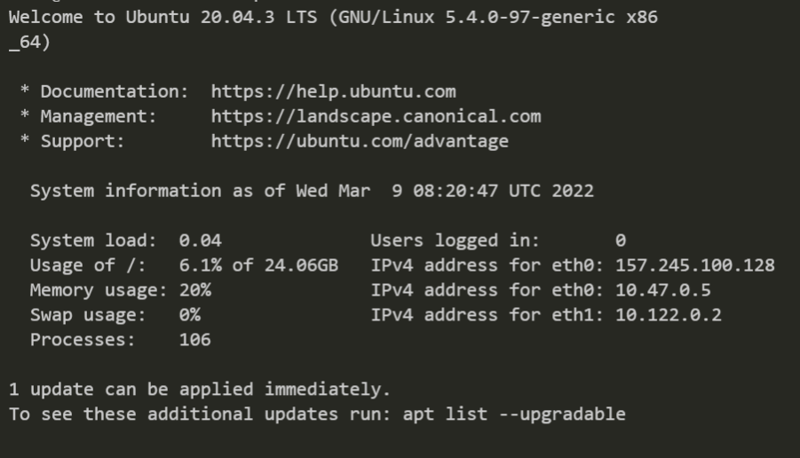

Now I can use this virtual machine as if it is installed on my own computer.

The first thing I would wanna do when starting a brand new VM, is to upgrade the packages.

Enter `apt upgrade` and `apt update` one after another to update all the packages.

```bash title=Terminal
apt upgrade
apt update
```

I can also log in to the droplet using the web-based interface.

Press the three dots next to the droplet. 
Click **Access Console**.

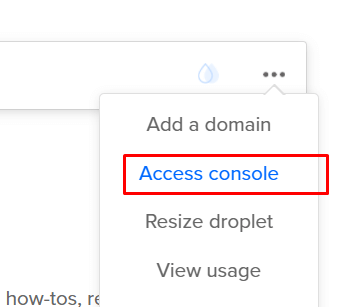

Click the **Launch Droplet Console** button.

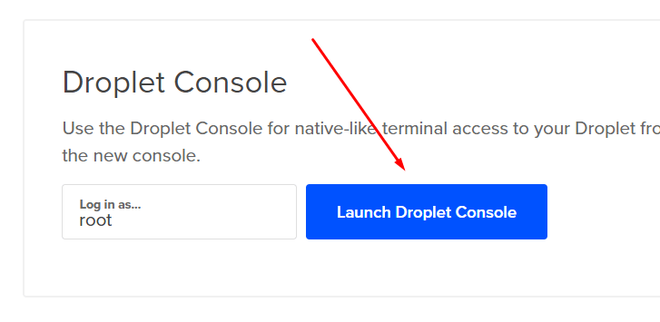

A new window will open up with a terminal emulator. It will be already logged into my VM.

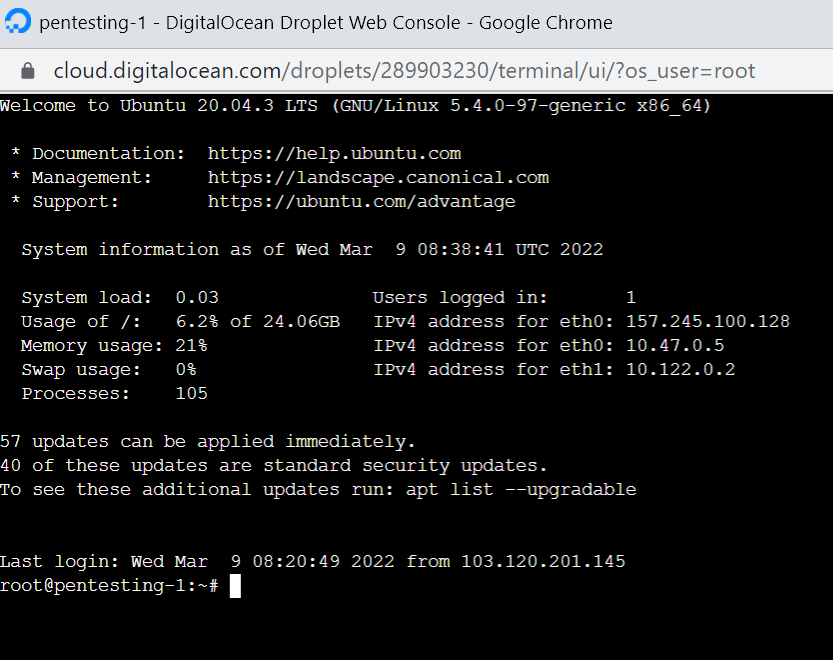

This let's me use the Linux distro the same way I work within the terminal.

**One downside of this web-based terminal** is, it's painfully slow. However, this could be my computer. If you experience the same input lag as me, you should stick with the Bash terminal instead.

## Installing Basic Pentesting Tools

Now that the pentesting VM is all set, I can go do some practice.

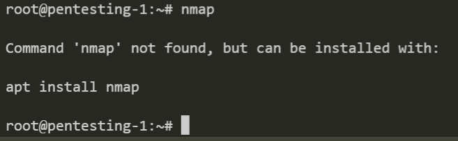

Since Ubuntu does not come with nmap, I can install using this command:

```bash title=Terminal
apt install nmap
```

Then run a basic test by doing

```bash title=Terminal
nmap scanme.nmap.org
```

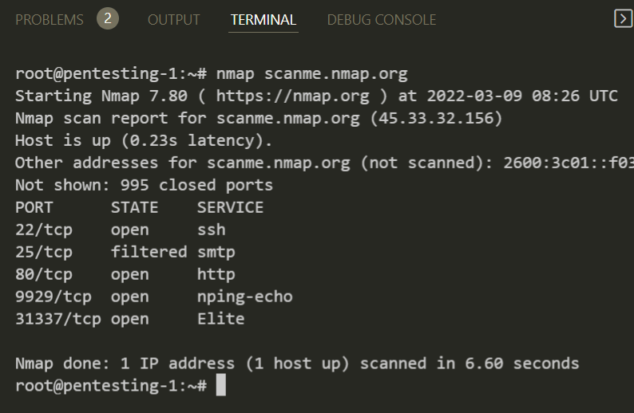

I won't go any deep into hacking since it's out of scope for this article.

## Destroy the Droplet to Stop Billing

One thing I want to mention is when you are not using your droplet for long period of time, it would be a nice idea to just destroy it to avoid racking up bills. You can also pause your droplet but it will still cost you money.

If you are not actively using your VM, go ahead and destroy it. **Destroying your droplet is irreversible**, so think before your delete.

I am going to destroy this droplet since I created it for this tutorial.

Press the three dots:

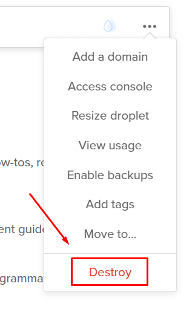

Type in the droplet name and hit **Destroy**.

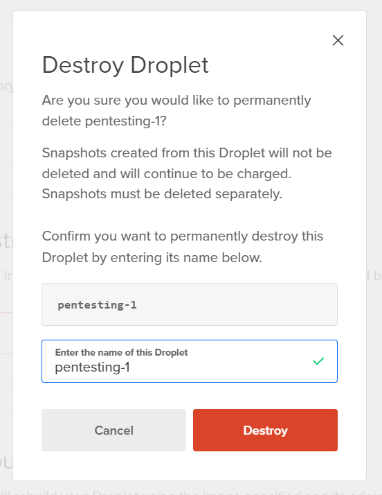

## Is it Allowed to Use Digital Ocean for Pentesting?

Hacking a company website without their explicit written permission is illegal. You should not attempt to use any VM, whether it's local or commercial to hack into sites.

If we read the [Digital Ocean's acceptable use policy](https://www.digitalocean.com/legal/acceptable-use-policy),

> **Unauthorized Access.**
>
> Accessing or using any System without permission, including attempting to probe, scan, or test the vulnerability of a System or to breach any security or authentication measures used by a System.
>
> **Interception.**
>
> Monitoring of data or traffic on a System without permission.

This all means that (black hat) hacking is not allowed.

However, if you are a white hat hacker you should be okay. Because ethical hacking by definition is taking written permission from a company to test their network in a controlled environment. Same goes with pentesting for educational purposes.

Use Digital Ocean VMs to only connect to your pentesting lab environments. If you do black hat hacking with DO and get caught, you will be liable, not them.

I hope you found this article helpful. [Do let me know your thoughts on Twitter](https://twitter.com/tamalweb).
