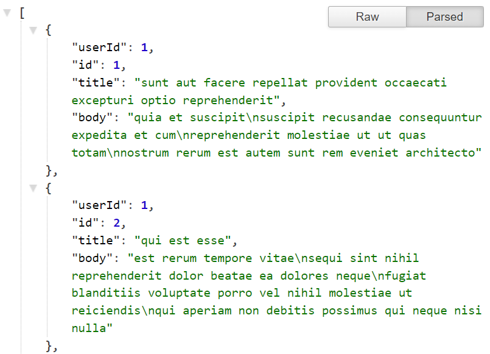
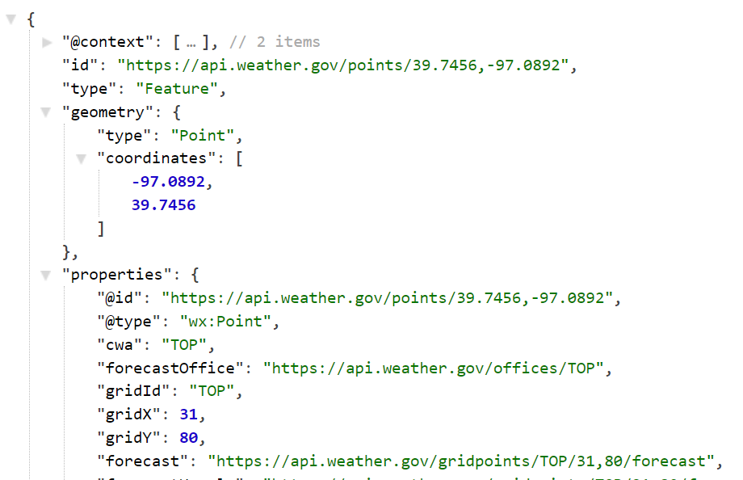

When building web apps, you will come across dynamic data created by your app or fetched by a third-party API. JSON is the universal data format for software, so if you master JSON, you will be a dangerous frontend engineer.


My article is all about mastering JSON with ReactJS so strap in!

<!-- truncate -->

## What is JSON in ReactJS?

**JavaScript Object Notation** is part of the core JavaScript language, not ReactJS. Since React is a JS library, it can access everything that the language supports. This data format is universal and can be used in any programming language or platform for data exchange from Python, PHP, Kotlin to Ruby, you name it.

In JavaScript, there is a global object called `JSON` which gives you only two methods to work with its data format:

1. `JSON.parse()`
2. `JSON.stringify()`

JSON is just a simple JavaScript object where the properties and values are wrapped around double-quotes.

```json title=freddy.json
{
  "Title": "Friday the 13th",
  "Year": "2009",
  "Rated": "R",
  "Released": "13 Feb 2009",
  "Runtime": "97 min",
  "Genre": "Horror, Mystery, Thriller",
  "Director": "Marcus Nispel"
}
```

This way we can easily send the object as a long string of text. And as you know, in computers, text take so little disk space.

`{"Title":"Friday the 13th","Year":"2009","Rated":"R","Released":"13 Feb 2009","Runtime":"97 min","Genre":"Horror, Mystery, Thriller","Director":"Marcus Nispel"}`

You might notice, JSON looks just like JS objects.

A JavaScript object is a combination of other primitive data types like String, Number, and Boolean.

```js title=script.js
const jason = {
  name: 'Jason Voorhees',
  age: 74,
  hasKilled: true,
  birthday: 'June 13, 1946',
}
```

Objects can also contain other objects and arrays, making them complex objects.

When you transform a JS object into JSON, all of it's properties and values will be wrapped in double quotes `" "` (except numbers and boolean).

**Original JS object:**

```js title=data.js
const person = {
  name: 'Jason Voorhees',
  age: 74,
  hasKilled: true,
  birthday: 'June 13, 1946',
}
```

**Converted JSON:**

```json title=data.json
{
  "name": "Jason Voorhees",
  "age": 74,
  "hasKilled": true,
  "birthday": "June 13, 1946"
}
```

Let's talk about what are some basic operations with this format in Reactjs,

## How to Read JSON Data in React?

To read data from JSON, you have to convert it into an object using the `JSON.parse()` method. When you receive some JSON from an API or from a file, it's like a long piece of text (String data).

Most JSON data will be wrapped around a pair of curly braces `{ }`, **JSON.parse()** will always return an object with properties you have to access.

I got this JSON from the [JSON Placeholder API](https://jsonplaceholder.typicode.com/posts)



As you can see, in this example the entire JSON response is wrapped with square brackets `[]`.

This means the entire JSON is an array for us to map over.

We will parse it using `JSON.parse()`.

**Step 1:** Parse it,

```js
const data = JSON.parse(jsonString)
```

This will create a new array object and save it into the `data` constant.

:::info
**parse** is a computer science word for changing some data into machine readable format.
:::

**Step 2:** access it's properties,

Since it's an array, I am accessing the first item's `title` property.

```js
console.log(data[0].title)
// >> "sunt aut facere repellat provident..."
```

But normally, when you get a response back from the server, the response data also contains a few header info.

It depends on how the API designer has created the JSON response. There will be a data property with the actual data you are looking for.

Let's take a look at the [weather API here](https://api.weather.gov/points/39.7456,-97.0892),



In this example the entire JSON is an object and the actual data we need is under the `properties` field. Sometimes the actual data is deeply nested in the json which you have to find out.

:::tip
Since JSON responses can vary from API to API, it's advised to do a `console.log()` to check the shape of the JSON response. You can also open it on a new tab and explore it using a browser extension called [**JSON Viewer**](https://chrome.google.com/webstore/detail/json-viewer/gbmdgpbipfallnflgajpaliibnhdgobh?hl=en-US).
:::

Here, I am calling this example API, getting the JSON response back, and converting it to an object by parsing it.

```js title=script.js
fetch('https://jsonplaceholder.typicode.com/posts')
  .then((res) => res.json())
  .then((resJson) => {
    const data = JSON.parse(resJson)
  })
```

Now that I have the data saved in a variable, the next task would be to save this data in a state for my React app to display.

## How do I Show JSON in Reactjs?

To show JSON data in Reactjs you can use hooks. You have to store the parsed data in your local state and let the app handle the display of the data.

Often times when we get some data back from the API, the data is an array of objects. We can cycle through each of the objects using the `Array.map()` method and display them with our own react component.

```jsx {3} title=App.jsx
function MyComponent() {
  return  ({
    items.map((item) => <SubComponent title={item.title} />)
  })
}
```

This is a common pattern you will see in React:

1. Get the data in JSON
2. Convert and save it in the local state
3. Map over the data from state
4. React will render the components automatically.

Here's the full example with a working component:

```jsx {1,4} title=App.jsx
import { useState, useEffect } from 'React'

function MyComponent() {
  const [items, setItems] = useState([])

  useEffect(() => {
    fetch('https://jsonplaceholder.typicode.com/posts')
      .then((res) => res.json())
      .then((resJson) => {
        const data = JSON.parse(resJson)
        setItems(data)
    })
  }, [])

  return  ({
    items.map((item) => <SubComponent key={item.id} title={item.title} />)
  })
}
```

### How do I show JSON in Reactjs? (Literally)

When you want to show the JSON data as is in your React app, you can simply wrap this data inside a code block like this:

```jsx
<code>{data}</code>
```

Giving you a nice code output.

But let's not get sidetracked, and talk about how can you create JSON and send it to the backend,

## How to Convert JSON Object to String in React JS?

To convert a JSON object to a string, you need to run it with `JSON.stringify()` method. The stringify method takes an object and returns a JSON string version ready to send to the server or store in localStorage.

Have your object ready, stringify it:

```js title=script.js
let jsonString = JSON.stringify(data)
```

### Sending JSON with fetch() API:

```js title=script.js
let jsonString = JSON.stringify(data)

fetch('THE_URL', {
  method: 'POST',
  headers: { 'Content-Type': 'application/json' },
  body: jsonString,
})
  .then()
  .catch(err)
```

### Storing JSON to browser using localStorage API:

```js title=script.js
let jsonString = JSON.stringify(data)

localStorage.setItem(nameOfData, jsonString)
```

## How do I load a JSON file into React JS?

To load JSON from file, you have to have the raw `.json` file saved in your `/src` directory. In Create React App, you can directly import the JSON file and it will work as if it were a JS object, no need to parse it again.

To load JSON from file, import it into your component.

Now access the properties as you do with regular objects.

```js
import data from './data.json'

console.log(data.title)

// >> "some data"
```

## When and Why should you load JSON from a file?

### During Development

When you are building and testing your app, you don't want to exhaust the API server by calling the API every few seconds. And it's a slow process to keep calling it and waiting for a response.

Just make one API call, grab the JSON and save it into a local file for the testing and design time.

Then when you are ready for production, swap out the local loading to API loading.

### To Save Loading Times

Sometimes the data is not dynamic, and you can just ship that into your application.

Like when I created The [Periodic Table website](./periodic-table-reactjs), I had to bring the 118 Atoms info in a JSON. Now they are not going to change that frequently. Instead of making a call every time the app loads, I can just have it loaded from a local file.

### To Save Disk Space

JSON files can be huge too! In some cases, you want to ship a small sub-set of the data to get the app loading quickly with info.

Let's say you are building a bible verses app.

Having the entire bible in a JSON would take a lot of disk storage and can hamper the loading times.

You can have a small section already loaded into your app from file and whenever the user requests more verses, you can call them on demand from the API.

## Conclusion:

To recap what we learned in this post,

- Convert JSON string to object using `JSON.parse()`
- Convert a data object into JSON string with `JSON.stringify()`
- Create React App can automatically convert a json to object when you import a .json file

**Read Next: [Best Practices on How to Compress Images For Reactjs](./compress-images-reactjs)**
