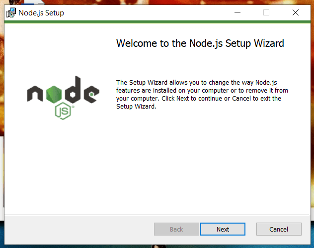

A local development environment is where all the development happens, after which devs push it to a live production server. In this article, you will set up a local web development environment on your computer for building modern web apps in Node.js and React. This setup is also suitable for other frontend frameworks like Vue, Angular, and Svelte.


<!-- truncate -->

### Prerequisites

To follow this tutorial, you will need the following:

- A modern laptop or desktop computer with internet access.

## Step 1 – Install Node.js on Your Computer

In this step, you will install Node.js on your computer. Node.js is a JavaScript runtime engine. All the modern JavaScript bundlers like Webpack and Gulp make use of Node.js to be able to do their bundling work. Even if you are not working as a backend developer, Node.js is required to work with frontend frameworks like React and Vue.

Go to the [official Node.js website](https://nodejs.org/) and download the latest **LTS** version of Node. Node has two versions, LTS, and current. LTS stands for long-term support and is recommended for development work. [Read more about the reason why you should pick the Node LTS version here](which-nodejs-version).

After downloading the Node LTS, open the installer and follow the installer steps to install Node into your system.



To verify your node installation, open your terminal or PowerShell in Windows and type the following command:

```bash
node -v
```

You will see an output like this:

```
v16.14.0
```

Now that you installed Node.js, it's time to install Git Bash.

## Step 2 – Install Git Bash for Windows Computers

In this step, you will install Git Bash to be able to run the Linux commands on your computer. If you are using Linux or Mac, then you can skip this step, because those systems already come with a built-in Bash terminal you can use.

Go to the [official Git Bash website](https://git-scm.com/download/win) and download the installer. Open the installer and follow the installer wizard to complete the installation.


This installs both Git and Bash sell environments into your computer. You will use them for the day-to-day development workflows.

Now that you have installed both Git and Bash, in the next step, you will install VS Code editor.

## Step 3 – Install VS Code Editor

In this step, you will install and set up VS Code on your computer. Although you can develop web apps in any editor in the world, VS Code is truly the de-facto standard for web development nowadays. By installing VS Code, you will get to use all the top extensions that will help you supercharge your development.

Go to the [official website for VS Code](https://code.visualstudio.com/) and download the installer for your operating system.

Open the installer and follow the installation process to finish setting it up.

Open VS Code,


Next up, you will install some handy extensions.

## Step 4 – Install Recommended VS Code extensions

In this step, you will install some additional extensions for VS Code. The editor already comes with many tools built in, and these extra extensions will speed up your development.

Open the extensions marketplace by clicking on the extension's icon. Search for the extension, click on it and install by clicking on the **Install** button.


Install these extensions for VS Code:

- **[Prettier](https://marketplace.visualstudio.com/items?itemName=esbenp.prettier-vscode)**: is a code formatter. It will automatically format your code by adding and removing spaces. Check out my video on YouTube on [how to configure prettier with VS Code](https://www.youtube.com/watch?v=dZU2HsrlGZ4&t=1s).
- **[Live Server](https://marketplace.visualstudio.com/items?itemName=ritwickdey.LiveServer)**: will create a live server for when you are working on a classical web development project. Please check out my video on [how to use the live-server extension to preview your projects](https://www.youtube.com/watch?v=i6EMMG6Hmjs).
- **[Auto Rename Tag](https://marketplace.visualstudio.com/items?itemName=formulahendry.auto-rename-tag)**: will auto rename HTML tags for you.

### Conclusion

You have set up your local web development environment. Your next step would be to create a sample website and host it on the internet.
