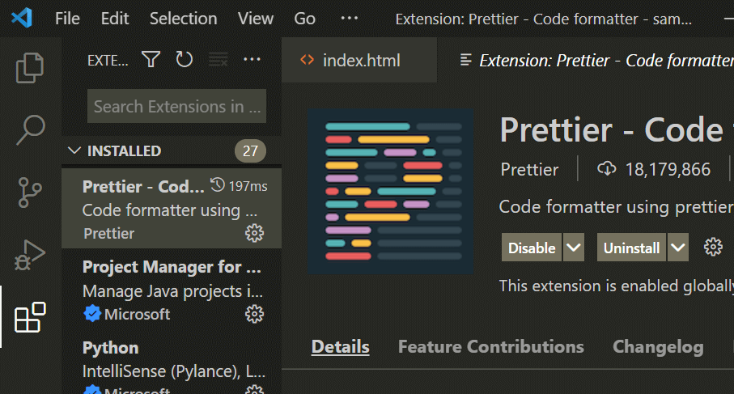

# Start Web Dev

If you are new to web development, this page will help you get started. It's not a step-by-step tutorial, but a general guideline of things that I learned over the course of many years.

:::info The goal of this page
I want to help you with a nice productive setup, so there will be fewer frustrations and more happy coding.
:::

## Tools You Need to Install

1. You need a code editor, [VS Code](https://code.visualstudio.com/) is the best for web developers.

2. [Node.js](https://nodejs.org/) (download the LTS version) -it's an engine that will help you run modern web development tooling.

3. If you are using Windows operating system, then download and install [Git SCM](https://git-scm.com/) for your computer.

You should be able to install the above software yourself, after all, you are the techy. If you run into an issue, Google and YouTube to troubleshoot.

## Writing Source Code

All the code we write, HTML, CSS, JS are called source code.

Open a folder with VS Code and create files.


Traditionally, we create an `index.html` file when we are just starting out and not using any external build tools (more on that later).

Type in a `!` to autofill with HTML boilerplate code.


This is a snippet shortcut comes for the default emmet plugin. I suggest you check out this [emmet cheat sheet](https://docs.emmet.io/cheat-sheet/) to learn some basic shortcuts.

## Live Preview your Changes

Saving a file and refreshing your browser is a pain. So we have tools that help us do the live preview.

Install this VS Code extension called **Live Server**.


Now after installing, click on your `index.html` file, and now you can click on the **Go Live** button and a new browser window will show up.


Now can you edit your code and see the changes.

If you are using a single monitor like me, I recommend you split your code editor and the preview window just like I do.


## Auto Format Your Code

Having good code formatting makes your code organized and professional.

You can spend a lot of time manually indenting all these code, but we have a better way.

Install this VS Code extension called **Prettier**.



Go to settings


Go to Text Editor > Formatting > enable format on save


Prettier will auto-format your code when you save your file.

Now write your code, hit CTRL+S and your code is autoformatted.


## Dealing With Errors

Errors are part of coding.

Every time you want to implement something new, you will likely face issues.

Most issues are a result of a typo in your file name like you forgot to link the CSS, JS or you are referencing a variable that has an extra letter.

For this very reason, every time you create a new CSS file, add a hello world command to verify you have properly linked the stylesheet:

```css title=style.css
body {
  background-color: yellow;
}
```

If you have properly linked your CSS with HTML, you will see the background turning yellow, and it's hard to miss.

If you don't see the bg changing, that means there is a problem in linking the stylesheet.

The same goes for JavaScript files.

After creating and linking your new JS file, add this hello world alert into the code:

```js title=script.js
alert('Hello World')
```

Open your page and you will see an alert popping up on your page. That's when you know you have correctly linked your script file.

:::warning
Sometimes you are too tired to code, that is when you start doing silly mistakes like typos or failing to link a file properly. It's a sign you are coding too much and it's time to take a break. I recommend you go to sleep and get back tomorrow with fresh eyes.
:::

Your code could produce legitimate errors.

Most of these can be found in your browser console or on your editor terminal.

Read the error message and do a google search.

There is a chance that someone else has already faced the issue and already got a solution.

A big part of coding is to Google error codes and learn how to fix them.

One site that comes up frequently in this area is **StackOverflow**. It's like a question-answer website but for developers. You will find people asking the same question as yours and often these questions have the highest voted answers.

I suggest you create a profile in StackOverflow and when you find an answer that solves your problem, you upvote the answer.

## Dealing With Frustration

Often times doing a Google search and searching for a solution in StackOverflow can lead you to a dead end. Or perhaps the answer is suggesting a solution that you don't know how to implement.

You should take a step back and change your code to the last working piece (mainly doing a bunch of undo CTRL+Z operations)

This is where having other coding friends can help. You can upload your code to github and ask your friends to have a look and see if they can help.

A good live preview website for front-end engineers is Codepen.

You can add your HTML, CSS, and JS and have a standalone version of the thing you are building.

It's easier for your developer friends to look and poke around the code.

## Publish Your Website

You wanna show your work to your friends. While codepen is good for this, it's more for your developer buddies. For the general public, you wanna host the code somewhere.

Github is the first entry point you should think of when hosting your basic frontend code.

Initialize a git repo for your project.

Click on the git icon and initialize a repository.


:::info
When you initialize a new git repo, it will create a new `.git` hidden folder in the project directory. It's a config system to keep track of your file changes within your computer.
:::

Now add a commit message and commit your file changes to git by pressing the ☑ checkmark.


When you commit, it means you are tracking these files, or in other words, saving your progress.

The git part is done, you have to go to github.com for hosting your code, so we can publish your work.

:::info
Git is a version control system while Github is an online service to host and view your git visually.
:::

[Create a new repository](https://github.com/new), give it a proper name.

After you create a repo, it will provide you some instructions.


Since we already created the repo, we just need to push it.

Come back to your VS code window, and bring open the terminal.


Open your VS Code terminal and now enter these lines one by one you got when creating a new repo.


This is where Git SCM we installed earlier comes in handy.


Refresh your github repo page and verify that you have successfully uploaded the files:


Got to settings > Pages > select the branch `main` and save to enable github pages service.


You should see your site live within a few minutes in this new address.


Setup github pages and you can have your work ready for the world to see in this new address.
