I was looking into the periodic table and trying to memorize all the elements in order. One afternoon I thought, hey can I make the periodic table with my current CSS skills?

The periodic table is a collection of elements arranged in an oddly structured way. It has already been built in the past, but the question is, can I do it myself without looking?

<!-- truncate -->

## Making the Layout

The first task was to arrange all the elements in the peculiar order. The first idea that came into my mind was to make an HTML `<table>`, and put all the items inside the table cells. But tables are old and messy, not to mention, they are very hard to maintain.

I know CSS grid, so why not use that?

At that point I was a bit skeptical, and thought maybe I will have to use flexbox to achieve the task.

So each of these elements will be a `
`, and I will arrange them with CSS.

I made the elements like this:

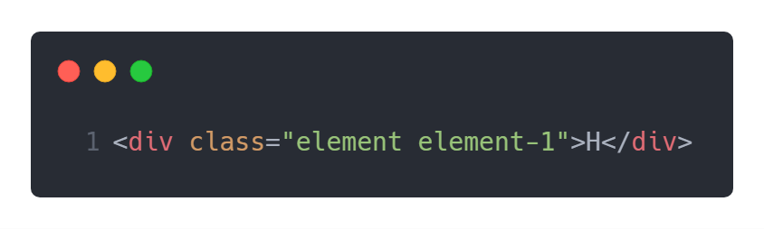

I put 2 classes, the element class to make the box, and element-1 to specifically control the position. I would have 118 elements altogether.

Instead of hand coding all 118 divs for my table, I used the emmet shorthand:

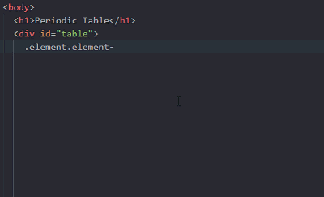

The table has 18 columns, so I made an 18 column layout with CSS grid.

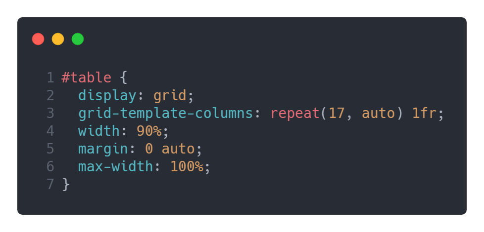

## The Tricky Part

Okay, so now that I have the container ready, I have to put Hydrogen as the first element and Helium all the way to the right.

I did this:

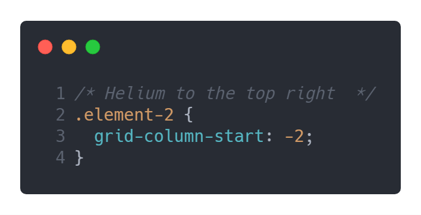

And it worked!

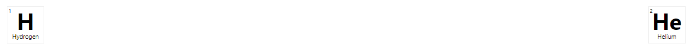

One by one, I arranged the elements in this manner. Since I append the exact element’s number as the class for each cell, I can easily control their positions in the table.

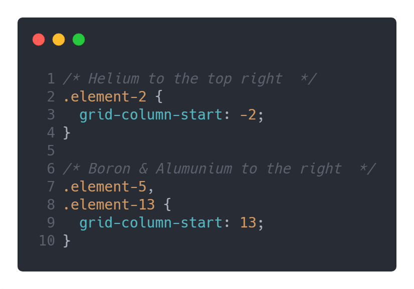

In the periodic table, there is a large gap between elements. Let’s take a look — the original periodic table is very long, about 32 columns:

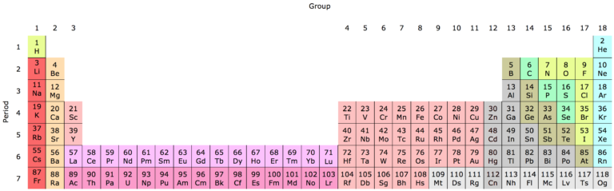

To prevent it from being this wide, there are versions of the table which carve out a separate grouping of elements. I had to do the same with my table.

So what I did was to separate the Lanthanide and Actinides from the markup and from the CSS.

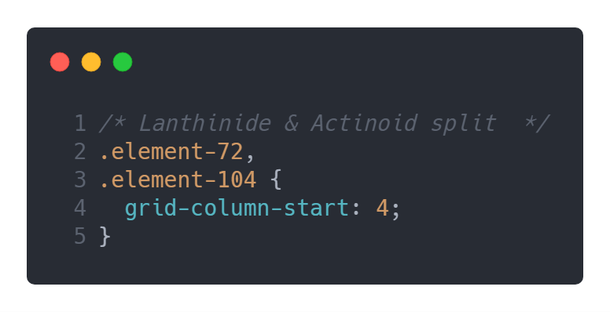

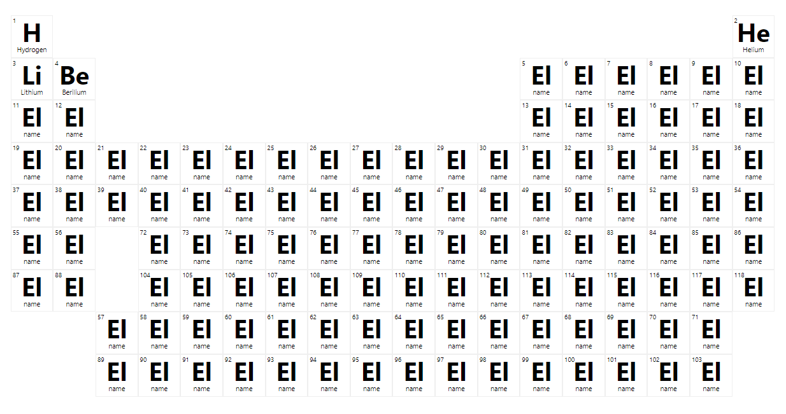

After the layout was ready, it’s now time to add the React.

## Filling the Table with Data

It was all fun and games filling out the first few elements. But soon I realized there are 100s of elements that needed to be added. Do I have to type out ever single one? It would suck the fun and life out of me.

So why not do the smart thing and pragmatically fill out the info?

I searched the internet and [found one JSON](https://github.com/Bowserinator/Periodic-Table-JSON) which has information about all the 118 items. So I added this data to my application.

In the JSON, there is an array of elements. My idea was to reference each element by their order. In an array, the first item starts at 0. That means Hydrogen is at zero, Helium is at 1, Lithium at 2 and so on. To avoid this confusion, I added a placeholder item in the 0th position. So now every element is correctly in the same position as it is in the periodic table.

Now that I have the data that I need, I can just make one React component to render all the elements and pass in the data as props.

Initially, I thought I need to pass in the name, the number, and the symbol of the element as the props to the React component.

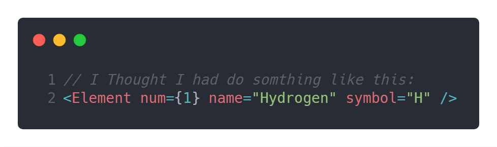

Then I realized I can just pass in the element’s number, and that would be enough to use the JSON data to extract the entire information about that particular element within the `<Element />` component.

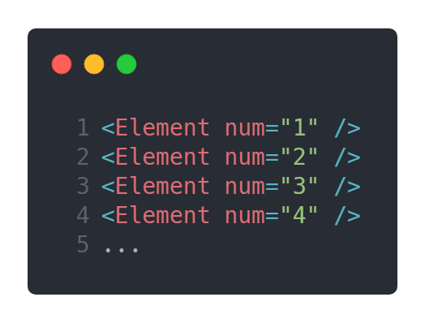

The rest was all about making the app interactive.

## Coloring the Element Groups

In the Periodic Table, each of the elements are ordered by their category and they are colored. So instead of coloring each of them I put their categories on the CSS too using the React component.

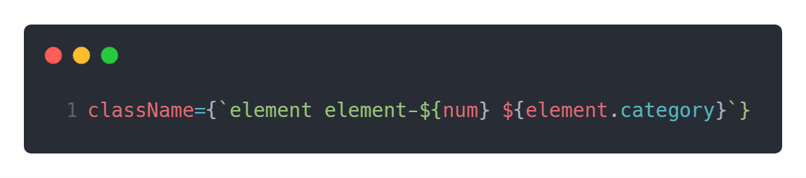

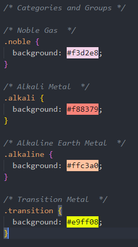

This gave the table that cool look.

## Making the Table Fit The Screen

To start, I made the table 1000 pixels in wide following the general layout practice. But that made the elements too tiny.

So I decided to make it fit the screen and utilized viewport width exclusively. I used vw for the element dimensions, text, and headings throughout the app. This helped to maintain the shape across screen sizes and devices. The table is mainly made for desktop screens, but it still looks okay on tablets too.

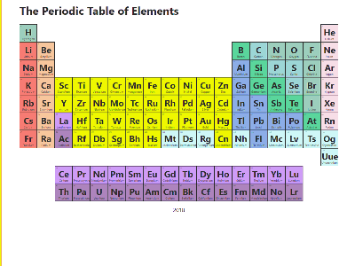

## Final Touches

The table is not complete if it just sits there doing nothing. I added a panel which displays additional information about the element when selected. React was great for this job. So why don’t you see it for yourself in action here?

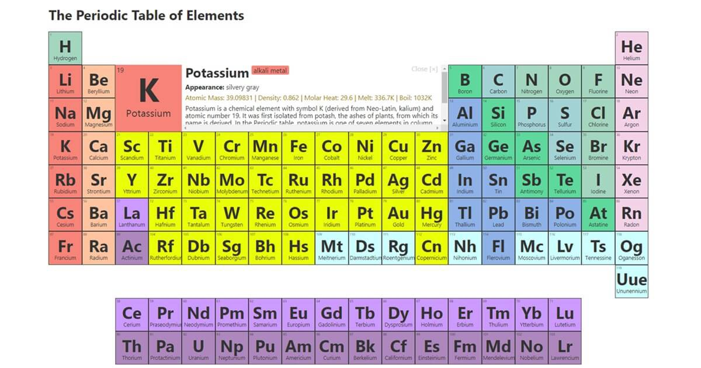

There are more things happening in the code, why don’t you dig inside and see it yourself? I welcome you to [copy the code/fork it from Github](https://github.com/tamalweb/periodic-table).
